# Multicast and IGMP Snooping Explained

## Overview

This guide explains multicast networking, IGMP snooping, and mDNS in the context of cross-VLAN Sonos configuration. It covers the fundamental concepts, how they work together, and why specific configuration choices were made.

## Communication Types

### 1. Unicast Communication

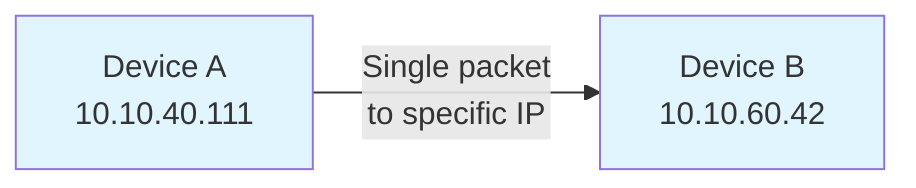
```mermaid
graph LR
    A[Device A<br/>10.10.40.111] -->|Single packet<br/>to specific IP| B[Device B<br/>10.10.60.42]
    style A fill:#e1f5ff
    style B fill:#e1f5ff
```

**Characteristics:**
- One-to-one communication
- Packet sent to specific destination IP
- Most efficient for point-to-point communication
- Example: Web browsing, SSH, HTTP requests

### 2. Broadcast Communication

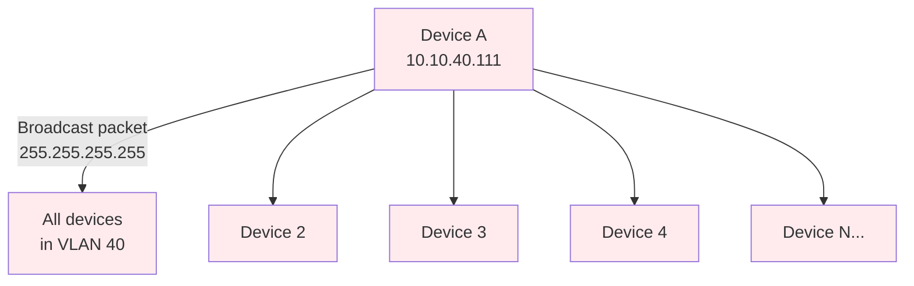
```mermaid
graph TD
    A[Device A<br/>10.10.40.111] -->|Broadcast packet<br/>255.255.255.255| B[All devices<br/>in VLAN 40]
    A --> C[Device 2]
    A --> D[Device 3]
    A --> E[Device 4]
    A --> F[Device N...]
    style A fill:#ffebee
    style B fill:#ffebee
    style C fill:#ffebee
    style D fill:#ffebee
    style E fill:#ffebee
    style F fill:#ffebee
```

**Characteristics:**
- One-to-all communication within broadcast domain
- Every device receives and processes packet
- Creates significant network overhead
- Limited to single VLAN/subnet (routers don't forward broadcasts)
- Example: ARP requests, DHCP discovery

### 3. Multicast Communication

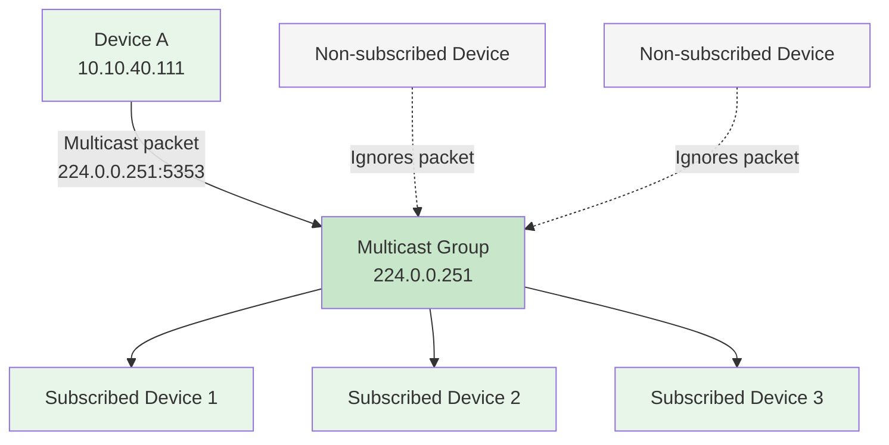
```mermaid
graph TD
    A[Device A<br/>10.10.40.111] -->|Multicast packet<br/>224.0.0.251:5353| G[Multicast Group<br/>224.0.0.251]
    G --> B[Subscribed Device 1]
    G --> C[Subscribed Device 2]
    G --> D[Subscribed Device 3]
    E[Non-subscribed Device] -.->|Ignores packet| G
    F[Non-subscribed Device] -.->|Ignores packet| G
    style A fill:#e8f5e9
    style G fill:#c8e6c9
    style B fill:#e8f5e9
    style C fill:#e8f5e9
    style D fill:#e8f5e9
    style E fill:#f5f5f5
    style F fill:#f5f5f5
```

**Characteristics:**
- One-to-many communication
- Only interested devices receive packets
- More efficient than broadcast for group communication
- Uses special IP range: 224.0.0.0 - 239.255.255.255
- Devices must "subscribe" to multicast groups
- Example: Video streaming, service discovery (mDNS), IPTV

**Multicast IP Ranges:**
- `224.0.0.0 - 224.0.0.255`: Reserved link-local (never forwarded by routers)
  - `224.0.0.251`: mDNS (Multicast DNS)
  - `224.0.0.1`: All systems on subnet
  - `224.0.0.2`: All routers on subnet
- `224.0.1.0 - 238.255.255.255`: Internetwork control and data
- `239.0.0.0 - 239.255.255.255`: Organization-local scope

## IGMP (Internet Group Management Protocol)

### What is IGMP?

IGMP is the protocol devices use to join/leave multicast groups and for routers/switches to track which devices want which multicast traffic.

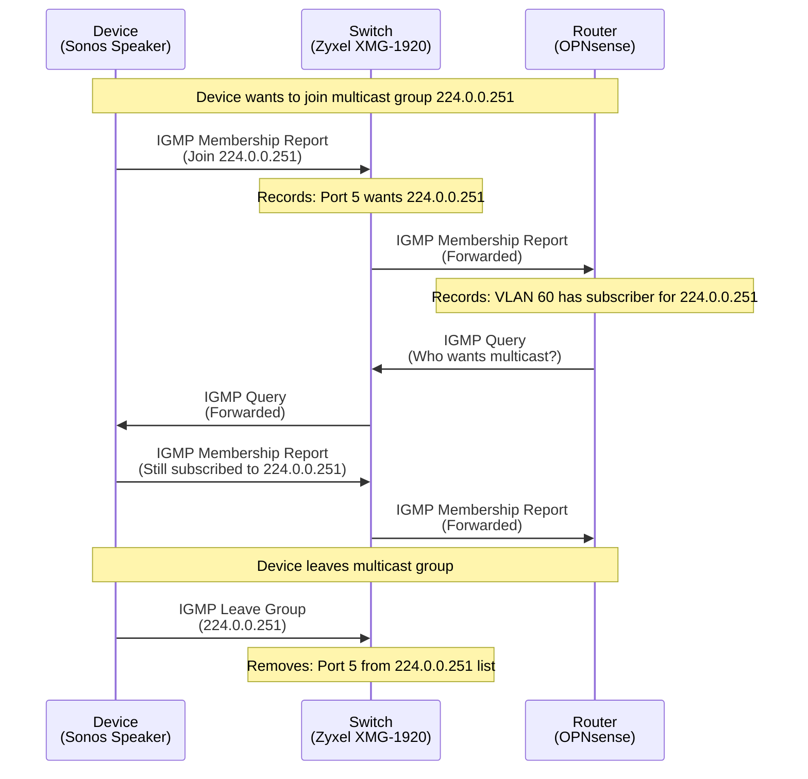
```mermaid
sequenceDiagram
    participant Device as Device<br/>(Sonos Speaker)
    participant Switch as Switch<br/>(Zyxel XMG-1920)
    participant Router as Router<br/>(OPNsense)
    
    Note over Device,Router: Device wants to join multicast group 224.0.0.251
    
    Device->>Switch: IGMP Membership Report<br/>(Join 224.0.0.251)
    Note over Switch: Records: Port 5 wants 224.0.0.251
    
    Switch->>Router: IGMP Membership Report<br/>(Forwarded)
    Note over Router: Records: VLAN 60 has subscriber for 224.0.0.251
    
    Router->>Switch: IGMP Query<br/>(Who wants multicast?)
    Switch->>Device: IGMP Query<br/>(Forwarded)
    
    Device->>Switch: IGMP Membership Report<br/>(Still subscribed to 224.0.0.251)
    Switch->>Router: IGMP Membership Report<br/>(Forwarded)
    
    Note over Device,Router: Device leaves multicast group
    
    Device->>Switch: IGMP Leave Group<br/>(224.0.0.251)
    Note over Switch: Removes: Port 5 from 224.0.0.251 list
```

### IGMP Protocol Details

**IGMP Message Types:**
1. **Membership Query** - Router/switch asks "who wants multicast traffic?"
   - General Query: Asks about all groups
   - Group-Specific Query: Asks about specific multicast group
   
2. **Membership Report** - Device says "I want traffic for group X"
   - Sent when joining group
   - Sent in response to queries
   
3. **Leave Group** - Device says "I no longer want traffic for group X"

**IGMP Versions:**
- **IGMPv1**: Basic join/leave (deprecated)
- **IGMPv2**: Added explicit leave messages
- **IGMPv3**: Source-specific multicast (can specify which sources to receive from)

### IGMP Querier

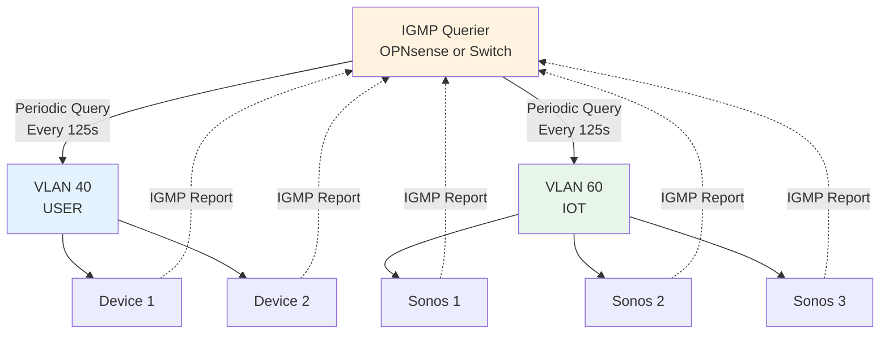
```mermaid
graph TD
    Q[IGMP Querier<br/>OPNsense or Switch] -->|Periodic Query<br/>Every 125s| V1[VLAN 40<br/>USER]
    Q -->|Periodic Query<br/>Every 125s| V2[VLAN 60<br/>IOT]
    
    V1 --> D1[Device 1]
    V1 --> D2[Device 2]
    V2 --> S1[Sonos 1]
    V2 --> S2[Sonos 2]
    V2 --> S3[Sonos 3]
    
    D1 -.->|IGMP Report| Q
    D2 -.->|IGMP Report| Q
    S1 -.->|IGMP Report| Q
    S2 -.->|IGMP Report| Q
    S3 -.->|IGMP Report| Q
    
    style Q fill:#fff3e0
    style V1 fill:#e3f2fd
    style V2 fill:#e8f5e9
```

**Purpose:**
- Sends periodic queries to discover which devices want multicast traffic
- Only ONE querier should be active per network segment
- Election process: Device with lowest IP becomes querier
- In your setup: OPNsense firewall is the querier, Zyxel switch has "IGMP Querier" enabled to handle queries when router doesn't

## IGMP Snooping

### Without IGMP Snooping

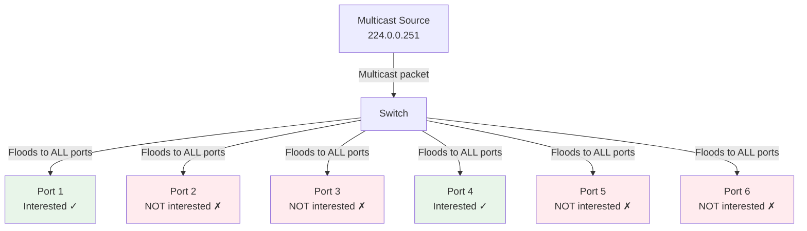
```mermaid
graph TD
    Source[Multicast Source<br/>224.0.0.251] -->|Multicast packet| Switch[Switch]
    Switch -->|Floods to ALL ports| P1[Port 1<br/>Interested ✓]
    Switch -->|Floods to ALL ports| P2[Port 2<br/>NOT interested ✗]
    Switch -->|Floods to ALL ports| P3[Port 3<br/>NOT interested ✗]
    Switch -->|Floods to ALL ports| P4[Port 4<br/>Interested ✓]
    Switch -->|Floods to ALL ports| P5[Port 5<br/>NOT interested ✗]
    Switch -->|Floods to ALL ports| P6[Port 6<br/>NOT interested ✗]
    
    style P2 fill:#ffebee
    style P3 fill:#ffebee
    style P5 fill:#ffebee
    style P6 fill:#ffebee
    style P1 fill:#e8f5e9
    style P4 fill:#e8f5e9
```

**Problem:** Multicast traffic floods all ports like broadcast, wasting bandwidth

### With IGMP Snooping

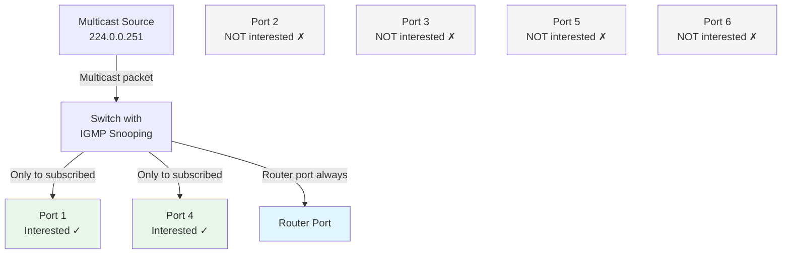
```mermaid
graph TD
    Source[Multicast Source<br/>224.0.0.251] -->|Multicast packet| Switch[Switch with<br/>IGMP Snooping]
    Switch -->|Only to subscribed| P1[Port 1<br/>Interested ✓]
    Switch -->|Only to subscribed| P4[Port 4<br/>Interested ✓]
    Switch -->|Router port always| Router[Router Port]
    
    P2[Port 2<br/>NOT interested ✗]
    P3[Port 3<br/>NOT interested ✗]
    P5[Port 5<br/>NOT interested ✗]
    P6[Port 6<br/>NOT interested ✗]
    
    style P1 fill:#e8f5e9
    style P4 fill:#e8f5e9
    style P2 fill:#f5f5f5
    style P3 fill:#f5f5f5
    style P5 fill:#f5f5f5
    style P6 fill:#f5f5f5
    style Router fill:#e1f5ff
```

**Solution:** Switch learns which ports want multicast traffic by inspecting IGMP messages

### How IGMP Snooping Works

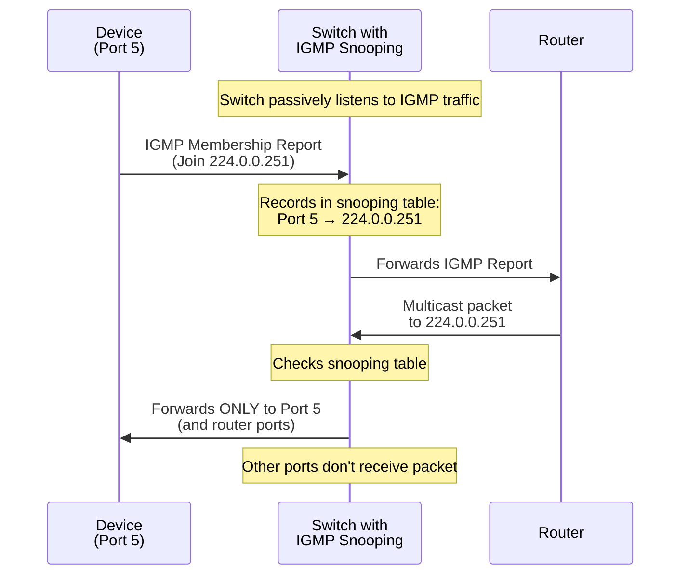
```mermaid
sequenceDiagram
    participant D as Device<br/>(Port 5)
    participant S as Switch with<br/>IGMP Snooping
    participant R as Router
    
    Note over S: Switch passively listens to IGMP traffic
    
    D->>S: IGMP Membership Report<br/>(Join 224.0.0.251)
    Note over S: Records in snooping table:<br/>Port 5 → 224.0.0.251
    S->>R: Forwards IGMP Report
    
    R->>S: Multicast packet<br/>to 224.0.0.251
    Note over S: Checks snooping table
    S->>D: Forwards ONLY to Port 5<br/>(and router ports)
    
    Note over S: Other ports don't receive packet
```

### IGMP Snooping Configuration Options

**1. IGMP Snooping (Enable/Disable)**
- **Enabled**: Switch inspects IGMP packets and learns multicast group membership
- **Disabled**: All multicast treated like broadcast (floods everywhere)
- **Your config**: Enabled (essential for efficiency)

**2. IGMP Querier (Enable/Disable)**
- **Enabled**: Switch sends IGMP queries if no router querier detected
- **Disabled**: Relies on router to send queries
- **Your config**: Enabled (backup in case OPNsense doesn't query)

**3. Unknown Multicast (Forward/Drop/Flood)**
- **Forward**: Send unknown multicast to router ports only
- **Drop**: Discard packets to unknown multicast groups
- **Flood**: Treat unknown multicast like broadcast
- **Your config**: Drop (prevents unnecessary flooding)

**4. Reserved Multicast Group (Forward/Drop/Flood)**
- Reserved range: 224.0.0.0 - 224.0.0.255 (includes mDNS 224.0.0.251)
- **Forward**: Send to router ports only
- **Drop**: Block reserved multicast (BREAKS mDNS!)
- **Flood**: Send to all ports (necessary for link-local protocols)
- **Your config**: Flooding (REQUIRED for mDNS to work)

**Why "Flooding" for Reserved Multicast?**
- Link-local multicast (224.0.0.x) is designed to NOT leave local network
- Protocols like mDNS rely on all devices seeing these packets
- Switch can't predict which devices need mDNS without complex inspection
- Flooding ensures discovery works correctly (slight overhead acceptable)

## OPNsense Services for Cross-VLAN Communication

OPNsense provides several services for forwarding different types of traffic between VLANs. Understanding which service to use and when is critical for proper network configuration.

### Service Comparison Table

| Service | Traffic Type | Protocol | Use Case | Complexity | Your Setup |
|---------|-------------|----------|----------|------------|------------|
| **DHCP Relay** | Broadcast | DHCP (UDP 67/68) | Centralized DHCP server for multiple VLANs | Low | Not used (DHCP per VLAN) |
| **IGMP Proxy** | Multicast | All multicast groups | Multicast routing (IPTV, video streaming) | High | Disabled (unnecessary) |
| **mDNS Repeater** | Multicast | mDNS only (224.0.0.251:5353) | Service discovery across VLANs | Low | **Enabled** ✓ |
| **UDP Broadcast Relay** | Broadcast | Any UDP port | Wake-on-LAN, legacy protocols | Medium | Disabled (caused loops) |

### DHCP Relay (dhcrelay)

#### What is DHCP Relay?

DHCP Relay forwards DHCP broadcast requests from clients to a DHCP server on a different VLAN/subnet, allowing centralized DHCP management.

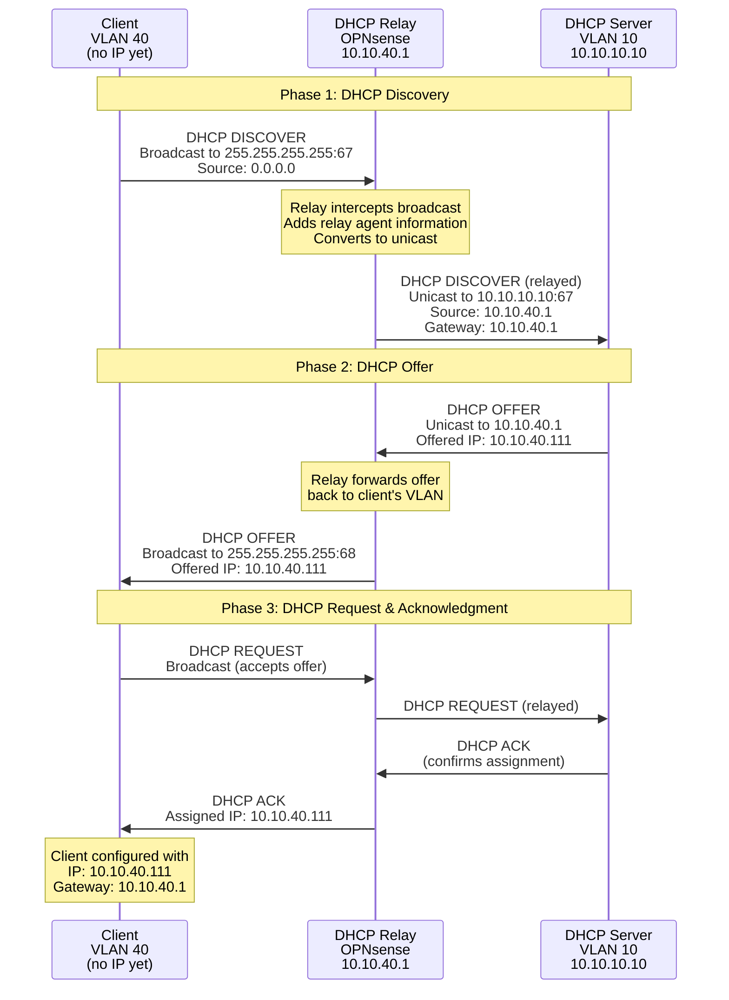
```mermaid
sequenceDiagram
    participant Client as Client<br/>VLAN 40<br/>(no IP yet)
    participant Relay as DHCP Relay<br/>OPNsense<br/>10.10.40.1
    participant Server as DHCP Server<br/>VLAN 10<br/>10.10.10.10
    
    Note over Client,Server: Phase 1: DHCP Discovery
    
    Client->>Relay: DHCP DISCOVER<br/>Broadcast to 255.255.255.255:67<br/>Source: 0.0.0.0
    
    Note over Relay: Relay intercepts broadcast<br/>Adds relay agent information<br/>Converts to unicast
    
    Relay->>Server: DHCP DISCOVER (relayed)<br/>Unicast to 10.10.10.10:67<br/>Source: 10.10.40.1<br/>Gateway: 10.10.40.1
    
    Note over Client,Server: Phase 2: DHCP Offer
    
    Server->>Relay: DHCP OFFER<br/>Unicast to 10.10.40.1<br/>Offered IP: 10.10.40.111
    
    Note over Relay: Relay forwards offer<br/>back to client's VLAN
    
    Relay->>Client: DHCP OFFER<br/>Broadcast to 255.255.255.255:68<br/>Offered IP: 10.10.40.111
    
    Note over Client,Server: Phase 3: DHCP Request & Acknowledgment
    
    Client->>Relay: DHCP REQUEST<br/>Broadcast (accepts offer)
    Relay->>Server: DHCP REQUEST (relayed)
    Server->>Relay: DHCP ACK<br/>(confirms assignment)
    Relay->>Client: DHCP ACK<br/>Assigned IP: 10.10.40.111
    
    Note over Client: Client configured with<br/>IP: 10.10.40.111<br/>Gateway: 10.10.40.1
```

**When to Use:**
- Single DHCP server for entire network
- Reduces configuration duplication
- Centralized IP address management
- Common in enterprise environments

**When NOT to Use:**
- Separate DHCP scopes needed per VLAN (your setup)
- Different lease times or options per network
- Security isolation requirements (IOT shouldn't know about USER DHCP)

**Your Setup:**
- Each VLAN has its own DHCP server configuration on OPNsense
- No relay needed - direct DHCP service per interface
- Better isolation and control

### IGMP Proxy

#### What is IGMP Proxy?

IGMP Proxy acts as a multicast router, allowing multicast streams to flow from an upstream network (source) to one or more downstream networks (subscribers). It's more complex than a simple repeater.

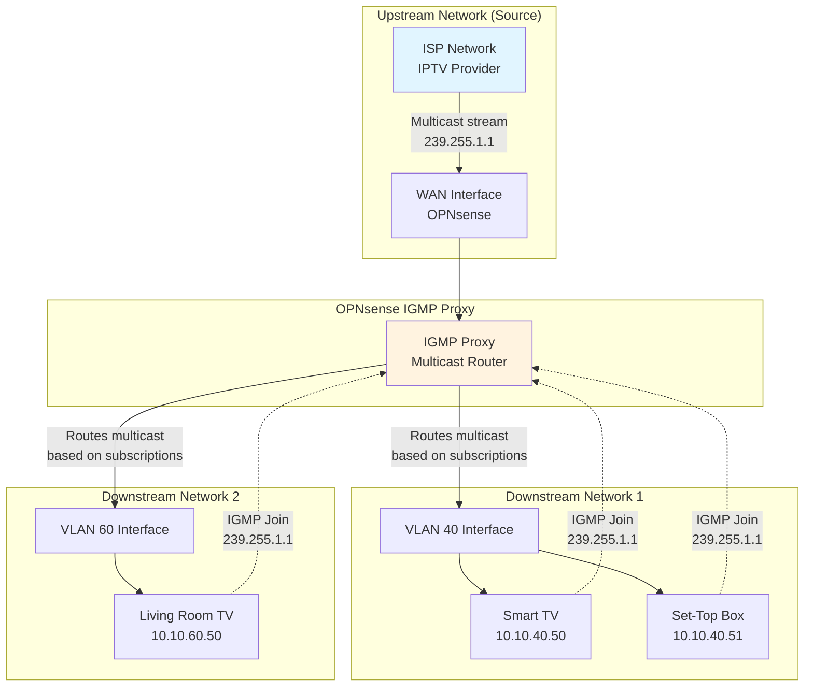
```mermaid
graph TB
    subgraph "Upstream Network (Source)"
        ISP[ISP Network<br/>IPTV Provider]
        WAN[WAN Interface<br/>OPNsense]
    end
    
    subgraph "OPNsense IGMP Proxy"
        PROXY[IGMP Proxy<br/>Multicast Router]
    end
    
    subgraph "Downstream Network 1"
        VLAN40[VLAN 40 Interface]
        TV1[Smart TV<br/>10.10.40.50]
        STB1[Set-Top Box<br/>10.10.40.51]
    end
    
    subgraph "Downstream Network 2"
        VLAN60[VLAN 60 Interface]
        TV2[Living Room TV<br/>10.10.60.50]
    end
    
    ISP -->|Multicast stream<br/>239.255.1.1| WAN
    WAN --> PROXY
    
    PROXY -->|Routes multicast<br/>based on subscriptions| VLAN40
    PROXY -->|Routes multicast<br/>based on subscriptions| VLAN60
    
    VLAN40 --> TV1
    VLAN40 --> STB1
    VLAN60 --> TV2
    
    TV1 -.->|IGMP Join<br/>239.255.1.1| PROXY
    STB1 -.->|IGMP Join<br/>239.255.1.1| PROXY
    TV2 -.->|IGMP Join<br/>239.255.1.1| PROXY
    
    style PROXY fill:#fff3e0
    style ISP fill:#e1f5ff
```

#### How IGMP Proxy Works

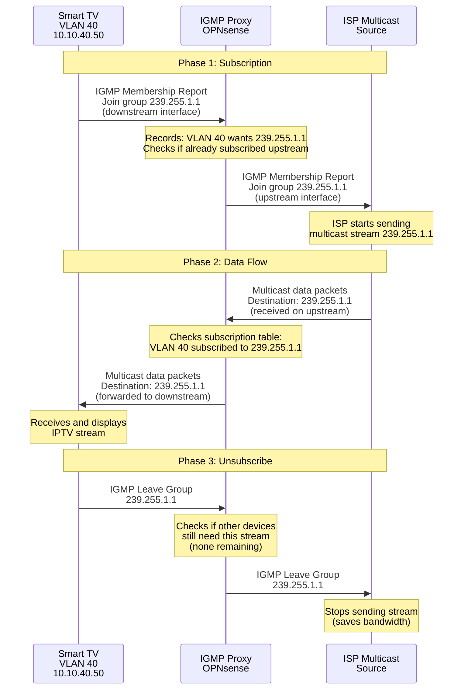
```mermaid
sequenceDiagram
    participant TV as Smart TV<br/>VLAN 40<br/>10.10.40.50
    participant Proxy as IGMP Proxy<br/>OPNsense
    participant ISP as ISP Multicast<br/>Source
    
    Note over TV,ISP: Phase 1: Subscription
    
    TV->>Proxy: IGMP Membership Report<br/>Join group 239.255.1.1<br/>(downstream interface)
    
    Note over Proxy: Records: VLAN 40 wants 239.255.1.1<br/>Checks if already subscribed upstream
    
    Proxy->>ISP: IGMP Membership Report<br/>Join group 239.255.1.1<br/>(upstream interface)
    
    Note over ISP: ISP starts sending<br/>multicast stream 239.255.1.1
    
    Note over TV,ISP: Phase 2: Data Flow
    
    ISP->>Proxy: Multicast data packets<br/>Destination: 239.255.1.1<br/>(received on upstream)
    
    Note over Proxy: Checks subscription table:<br/>VLAN 40 subscribed to 239.255.1.1
    
    Proxy->>TV: Multicast data packets<br/>Destination: 239.255.1.1<br/>(forwarded to downstream)
    
    Note over TV: Receives and displays<br/>IPTV stream
    
    Note over TV,ISP: Phase 3: Unsubscribe
    
    TV->>Proxy: IGMP Leave Group<br/>239.255.1.1
    
    Note over Proxy: Checks if other devices<br/>still need this stream<br/>(none remaining)
    
    Proxy->>ISP: IGMP Leave Group<br/>239.255.1.1
    
    Note over ISP: Stops sending stream<br/>(saves bandwidth)
```

**Configuration Terminology:**
- **Upstream Interface**: Where multicast SOURCE is located (e.g., WAN for IPTV)
- **Downstream Interface(s)**: Where multicast SUBSCRIBERS are located (e.g., LAN VLANs)

**When to Use:**
- IPTV service from ISP
- Video streaming servers on one VLAN, viewers on others
- Multicast data feeds (stock tickers, live data)
- Any scenario with upstream source and downstream subscribers

**When NOT to Use:**
- Simple service discovery (use mDNS Repeater instead)
- Link-local multicast (224.0.0.x range)
- Peer-to-peer multicast (no clear upstream/downstream)
- Bidirectional multicast communication

**Why Not Used in Your Setup:**
- Sonos uses peer-to-peer discovery (no upstream/downstream)
- Both VLANs have devices that act as sources AND subscribers
- Link-local multicast (224.0.0.251) not routed by IGMP proxy
- mDNS Repeater is simpler and more appropriate

**Common Pitfall:**
- Incorrectly configured upstream/downstream can break multicast entirely
- Multiple queriers can cause conflicts (disable on downstream VLANs)
- Too complex for simple discovery use cases

### mDNS Repeater

#### What is mDNS Repeater?

mDNS Repeater is a simple relay that copies mDNS packets (224.0.0.251:5353) between multiple interfaces. It's bidirectional and doesn't care about upstream/downstream.

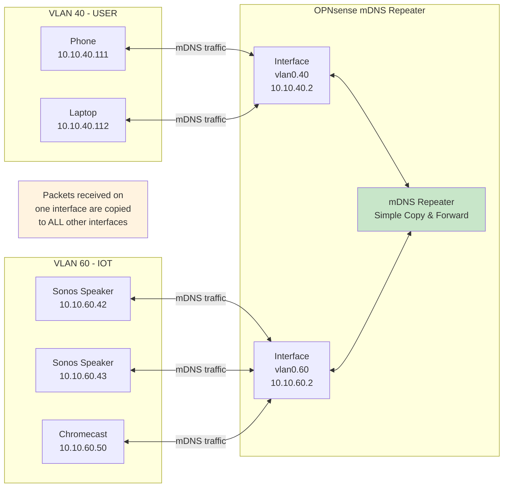
```mermaid
graph LR
    subgraph "VLAN 40 - USER"
        Phone[Phone<br/>10.10.40.111]
        Laptop[Laptop<br/>10.10.40.112]
    end
    
    subgraph "OPNsense mDNS Repeater"
        Repeater[mDNS Repeater<br/>Simple Copy & Forward]
        Int40[Interface<br/>vlan0.40<br/>10.10.40.2]
        Int60[Interface<br/>vlan0.60<br/>10.10.60.2]
    end
    
    subgraph "VLAN 60 - IOT"
        Sonos1[Sonos Speaker<br/>10.10.60.42]
        Sonos2[Sonos Speaker<br/>10.10.60.43]
        Chromecast[Chromecast<br/>10.10.60.50]
    end
    
    Phone <-->|mDNS traffic| Int40
    Laptop <-->|mDNS traffic| Int40
    
    Int40 <--> Repeater
    Int60 <--> Repeater
    
    Sonos1 <-->|mDNS traffic| Int60
    Sonos2 <-->|mDNS traffic| Int60
    Chromecast <-->|mDNS traffic| Int60
    
    Note1[Packets received on<br/>one interface are copied<br/>to ALL other interfaces]
    
    style Repeater fill:#c8e6c9
    style Note1 fill:#fff3e0
```

#### How mDNS Repeater Works

**Operational Model:**
1. Listens on ALL configured interfaces
2. When packet arrives on interface A → copies to interfaces B, C, D...
3. No routing decisions, no upstream/downstream concept
4. Simple, fast, bidirectional

**Packet Transformation:**
```
Original packet from Sonos (VLAN 60):
  Source IP: 10.10.60.42
  Source Port: 5353
  Dest IP: 224.0.0.251 (multicast)
  Dest Port: 5353
  Payload: "I'm Living Room speaker"

After mDNS Repeater forwards to VLAN 40:
  Source IP: 10.10.40.2 (OPNsense VLAN 40 IP) ⚠️ CHANGED
  Source Port: 5353
  Dest IP: 224.0.0.251 (multicast)
  Dest Port: 5353
  Payload: "I'm Living Room speaker" (unchanged)
```

**Source IP Rewrite Issue:**
- Repeater rewrites source IP to its own interface IP
- Acts like NAT for multicast
- Some strict apps reject responses with mismatched IPs
- Spotify Connect works, Sonos app doesn't

**When to Use:**
- Service discovery across VLANs (mDNS, Bonjour)
- Chromecast discovery
- AirPlay discovery
- Smart home device discovery
- Any zero-configuration protocol using 224.0.0.251:5353

**When NOT to Use:**
- Other multicast groups (use IGMP proxy)
- Broadcast traffic (use UDP broadcast relay)
- When source IP accuracy is critical

**Advantages:**
- Simple configuration (just select interfaces)
- Low CPU overhead
- Bidirectional by design
- Works with CARP failover

**Your Setup:**
- Interfaces: `vlan0.40` (USER), `vlan0.60` (IOT)
- CARP Failover: Enabled (runs on MASTER node only)
- Perfect for Sonos + Spotify Connect discovery

### UDP Broadcast Relay

#### What is UDP Broadcast Relay?

UDP Broadcast Relay forwards UDP broadcast packets (255.255.255.255) for specific ports between VLANs. Unlike multicast repeater, it handles broadcast domain extensions.

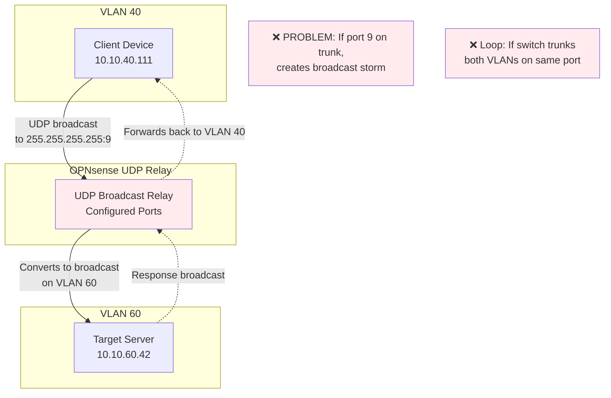
```mermaid
graph TD
    subgraph "VLAN 40"
        Client[Client Device<br/>10.10.40.111]
    end
    
    subgraph "OPNsense UDP Relay"
        Relay[UDP Broadcast Relay<br/>Configured Ports]
    end
    
    subgraph "VLAN 60"
        Server[Target Server<br/>10.10.60.42]
    end
    
    Client -->|UDP broadcast<br/>to 255.255.255.255:9| Relay
    
    Note1[❌ PROBLEM: If port 9 on trunk,<br/>creates broadcast storm]
    
    Relay -->|Converts to broadcast<br/>on VLAN 60| Server
    Server -.->|Response broadcast| Relay
    Relay -.->|Forwards back to VLAN 40| Client
    
    Note2[❌ Loop: If switch trunks<br/>both VLANs on same port]
    
    style Note1 fill:#ffebee
    style Note2 fill:#ffebee
    style Relay fill:#ffebee
```

#### Why UDP Broadcast Relay Failed

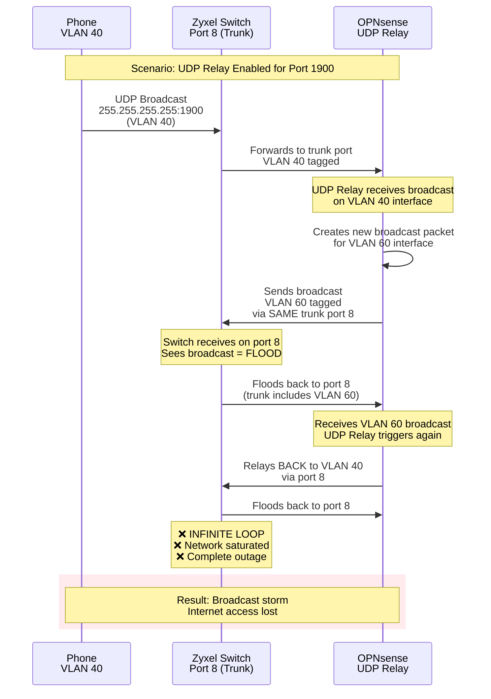
```mermaid
sequenceDiagram
    participant Phone as Phone<br/>VLAN 40
    participant Switch as Zyxel Switch<br/>Port 8 (Trunk)
    participant OPN as OPNsense<br/>UDP Relay
    
    Note over Phone,OPN: Scenario: UDP Relay Enabled for Port 1900
    
    Phone->>Switch: UDP Broadcast<br/>255.255.255.255:1900<br/>(VLAN 40)
    
    Switch->>OPN: Forwards to trunk port<br/>VLAN 40 tagged
    
    Note over OPN: UDP Relay receives broadcast<br/>on VLAN 40 interface
    
    OPN->>OPN: Creates new broadcast packet<br/>for VLAN 60 interface
    
    OPN->>Switch: Sends broadcast<br/>VLAN 60 tagged<br/>via SAME trunk port 8
    
    Note over Switch: Switch receives on port 8<br/>Sees broadcast = FLOOD
    
    Switch->>OPN: Floods back to port 8<br/>(trunk includes VLAN 60)
    
    Note over OPN: Receives VLAN 60 broadcast<br/>UDP Relay triggers again
    
    OPN->>Switch: Relays BACK to VLAN 40<br/>via port 8
    
    Switch->>OPN: Floods back to port 8
    
    Note over Switch: ❌ INFINITE LOOP<br/>❌ Network saturated<br/>❌ Complete outage
    
    rect rgb(255, 235, 238)
        Note over Phone,OPN: Result: Broadcast storm<br/>Internet access lost
    end
```

**The Fundamental Problem:**
1. OPNsense and switch connected via single trunk port
2. UDP relay receives broadcast on VLAN A
3. Relay sends broadcast on VLAN B → same trunk
4. Switch floods broadcast back to trunk (includes VLAN B)
5. Relay sees VLAN B broadcast → sends to VLAN A → loop!

**When UDP Broadcast Relay Works:**
- Separate physical links between router and switch per VLAN
- One-way broadcast forwarding (source VLAN has no relay listeners)
- Careful firewall rules to prevent return broadcasts

**When to Use (Carefully):**
- Wake-on-LAN across VLANs
- Legacy Windows network browsing (NetBIOS)
- Some gaming protocols (depends on game)
- Specific UDP-based discovery (non-multicast)

**When NOT to Use:**
- Shared trunk port topology (your setup)
- When multicast alternatives exist (use mDNS repeater)
- Protocols that have multicast options
- Already complex network (risk of loops)

**Why It Failed in Your Setup:**
- Single trunk carries all VLANs to OPNsense
- Reserved multicast flooding enabled (necessary for mDNS)
- Relay + flooding = unavoidable packet loop
- Complete network saturation within seconds

### Service Decision Matrix

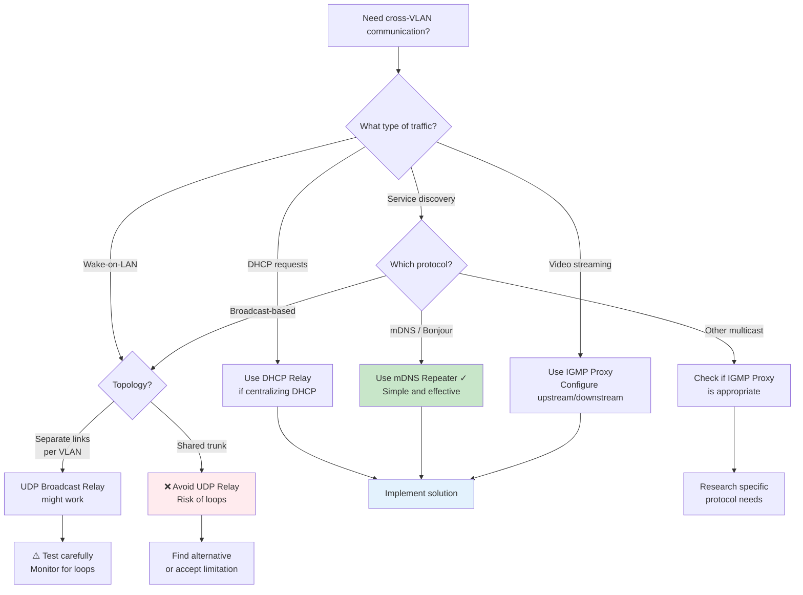
```mermaid
graph TD
    Start[Need cross-VLAN communication?] --> Q1{What type of traffic?}
    
    Q1 -->|DHCP requests| DHCP[Use DHCP Relay<br/>if centralizing DHCP]
    Q1 -->|Service discovery| Q2{Which protocol?}
    Q1 -->|Video streaming| IGMP[Use IGMP Proxy<br/>Configure upstream/downstream]
    Q1 -->|Wake-on-LAN| Q3{Topology?}
    
    Q2 -->|mDNS / Bonjour| MDNS[Use mDNS Repeater ✓<br/>Simple and effective]
    Q2 -->|Other multicast| CHECK[Check if IGMP Proxy<br/>is appropriate]
    Q2 -->|Broadcast-based| Q3
    
    Q3 -->|Separate links<br/>per VLAN| UDP[UDP Broadcast Relay<br/>might work]
    Q3 -->|Shared trunk| AVOID[❌ Avoid UDP Relay<br/>Risk of loops]
    
    DHCP --> Implement[Implement solution]
    MDNS --> Implement
    IGMP --> Implement
    UDP --> Careful[⚠️ Test carefully<br/>Monitor for loops]
    CHECK --> Research[Research specific<br/>protocol needs]
    AVOID --> Alternative[Find alternative<br/>or accept limitation]
    
    style MDNS fill:#c8e6c9
    style AVOID fill:#ffebee
    style Implement fill:#e3f2fd
```

### Service Interactions with IGMP Snooping

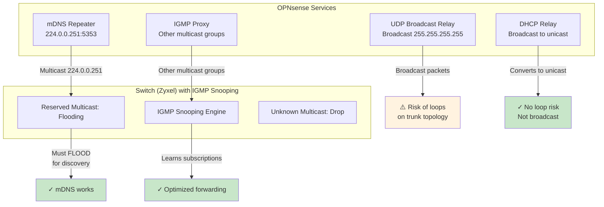
```mermaid
graph TB
    subgraph "Switch (Zyxel) with IGMP Snooping"
        Snooping[IGMP Snooping Engine]
        Reserved[Reserved Multicast: Flooding]
        Unknown[Unknown Multicast: Drop]
    end
    
    subgraph "OPNsense Services"
        MDNS[mDNS Repeater<br/>224.0.0.251:5353]
        IGMP_P[IGMP Proxy<br/>Other multicast groups]
        UDP[UDP Broadcast Relay<br/>Broadcast 255.255.255.255]
        DHCP_R[DHCP Relay<br/>Broadcast to unicast]
    end
    
    MDNS -->|Multicast 224.0.0.251| Reserved
    Reserved -->|Must FLOOD<br/>for discovery| Success1[✓ mDNS works]
    
    IGMP_P -->|Other multicast groups| Snooping
    Snooping -->|Learns subscriptions| Success2[✓ Optimized forwarding]
    
    UDP -->|Broadcast packets| Risk[⚠️ Risk of loops<br/>on trunk topology]
    
    DHCP_R -->|Converts to unicast| Success3[✓ No loop risk<br/>Not broadcast]
    
    style Success1 fill:#c8e6c9
    style Success2 fill:#c8e6c9
    style Success3 fill:#c8e6c9
    style Risk fill:#fff3e0
```

**Key Interactions:**

1. **mDNS Repeater + Reserved Multicast Flooding**
   - mDNS uses 224.0.0.251 (reserved range)
   - Switch MUST flood reserved multicast
   - Setting to "Drop" breaks mDNS completely
   - Slight overhead acceptable for discovery

2. **IGMP Proxy + IGMP Snooping**
   - Work together perfectly
   - Proxy manages subscriptions
   - Snooping optimizes forwarding
   - Querier role can conflict (disable on downstream)

3. **UDP Broadcast Relay + IGMP Snooping**
   - Snooping doesn't affect broadcast
   - Risk of loops independent of snooping
   - Topology matters more than snooping config

4. **DHCP Relay + IGMP Snooping**
   - No interaction (different protocols)
   - DHCP uses broadcast then unicast
   - Relay converts broadcast to unicast
   - No multicast involved

### Summary: Which Service for Your Setup?

| Requirement | Service | Status | Reason |
|------------|---------|--------|--------|
| Sonos discovery | mDNS Repeater | ✅ Enabled | Simple, works with Spotify Connect |
| IPTV streaming | IGMP Proxy | ❌ Not needed | No IPTV service |
| Centralized DHCP | DHCP Relay | ❌ Not needed | Separate DHCP per VLAN preferred |
| Wake-on-LAN | UDP Broadcast Relay | ❌ Disabled | Causes loops on trunk topology |
| Chromecast discovery | mDNS Repeater | ✅ Enabled | Same as Sonos (mDNS protocol) |

**Configuration Philosophy:**
- Use simplest solution that works
- Avoid services that create loop risks
- Accept minor limitations (Sonos app) over complex configs
- Prefer multicast over broadcast when possible

## mDNS (Multicast DNS)

### What is mDNS?

mDNS allows devices to discover services on local network without DNS server. Used by:
- Apple Bonjour
- Google Chromecast
- Sonos speakers
- Smart home devices
- Many IoT devices

**Key Properties:**
- Multicast group: `224.0.0.251`
- Port: `5353` (UDP)
- Link-local only (doesn't cross routers by default)
- No configuration needed (zero-conf)

### mDNS Discovery Flow (Single VLAN)

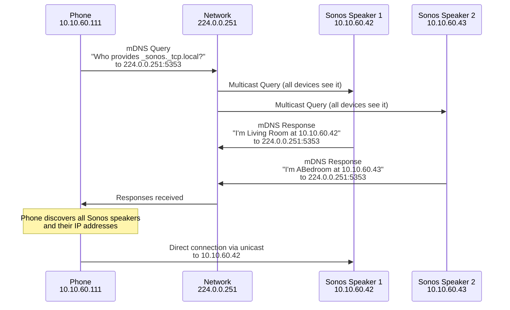
```mermaid
sequenceDiagram
    participant Phone as Phone<br/>10.10.60.111
    participant Network as Network<br/>224.0.0.251
    participant Speaker1 as Sonos Speaker 1<br/>10.10.60.42
    participant Speaker2 as Sonos Speaker 2<br/>10.10.60.43
    
    Phone->>Network: mDNS Query<br/>"Who provides _sonos._tcp.local?"<br/>to 224.0.0.251:5353
    
    Network->>Speaker1: Multicast Query (all devices see it)
    Network->>Speaker2: Multicast Query (all devices see it)
    
    Speaker1->>Network: mDNS Response<br/>"I'm Living Room at 10.10.60.42"<br/>to 224.0.0.251:5353
    Speaker2->>Network: mDNS Response<br/>"I'm ABedroom at 10.10.60.43"<br/>to 224.0.0.251:5353
    
    Network->>Phone: Responses received
    
    Note over Phone: Phone discovers all Sonos speakers<br/>and their IP addresses
    
    Phone->>Speaker1: Direct connection via unicast<br/>to 10.10.60.42
```

### The Cross-VLAN Problem

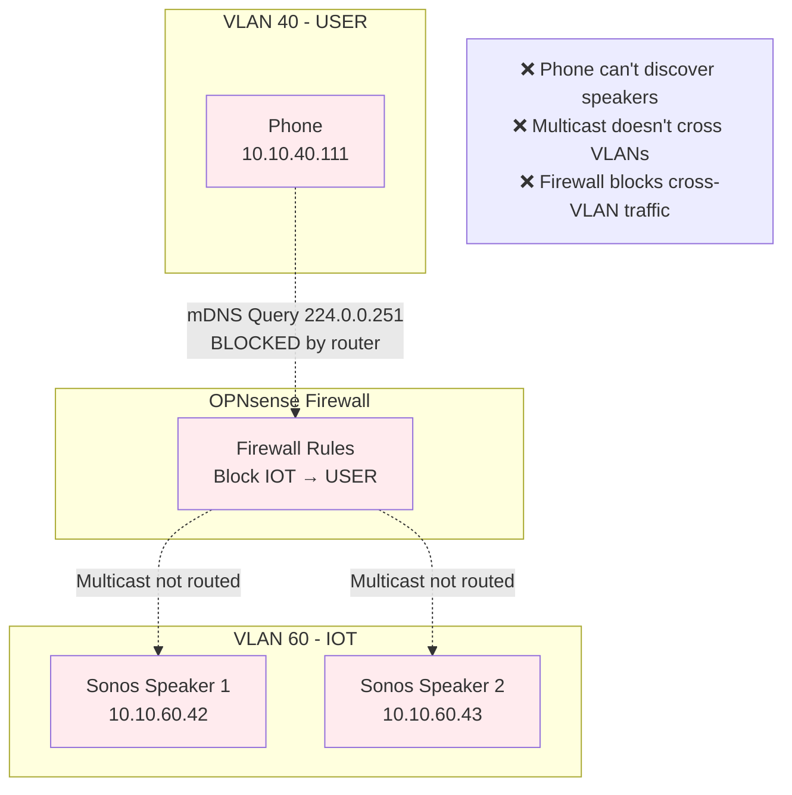
```mermaid
graph TD
    subgraph VLAN 40 - USER
        Phone[Phone<br/>10.10.40.111]
    end
    
    subgraph Router [OPNsense Firewall]
        FW[Firewall Rules<br/>Block IOT → USER]
    end
    
    subgraph VLAN 60 - IOT
        S1[Sonos Speaker 1<br/>10.10.60.42]
        S2[Sonos Speaker 2<br/>10.10.60.43]
    end
    
    Phone -.->|mDNS Query 224.0.0.251<br/>BLOCKED by router| FW
    FW -.->|Multicast not routed| S1
    FW -.->|Multicast not routed| S2
    
    style Phone fill:#ffebee
    style S1 fill:#ffebee
    style S2 fill:#ffebee
    style FW fill:#ffebee
    
    Note[❌ Phone can't discover speakers<br/>❌ Multicast doesn't cross VLANs<br/>❌ Firewall blocks cross-VLAN traffic]
```

**Problems:**
1. Routers don't forward link-local multicast (224.0.0.x) by design
2. VLANs are isolated broadcast/multicast domains
3. Firewall rules prevent cross-VLAN communication

### mDNS Repeater Solution

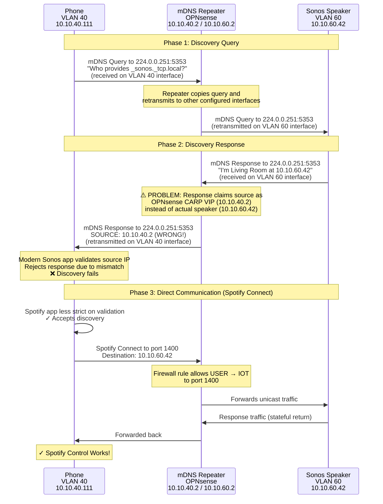
```mermaid
sequenceDiagram
    participant Phone as Phone<br/>VLAN 40<br/>10.10.40.111
    participant Repeater as mDNS Repeater<br/>OPNsense<br/>10.10.40.2 / 10.10.60.2
    participant Speaker as Sonos Speaker<br/>VLAN 60<br/>10.10.60.42
    
    Note over Phone,Speaker: Phase 1: Discovery Query
    
    Phone->>Repeater: mDNS Query to 224.0.0.251:5353<br/>"Who provides _sonos._tcp.local?"<br/>(received on VLAN 40 interface)
    
    Note over Repeater: Repeater copies query and<br/>retransmits to other configured interfaces
    
    Repeater->>Speaker: mDNS Query to 224.0.0.251:5353<br/>(retransmitted on VLAN 60 interface)
    
    Note over Phone,Speaker: Phase 2: Discovery Response
    
    Speaker->>Repeater: mDNS Response to 224.0.0.251:5353<br/>"I'm Living Room at 10.10.60.42"<br/>(received on VLAN 60 interface)
    
    Note over Repeater: ⚠️ PROBLEM: Response claims source as<br/>OPNsense CARP VIP (10.10.40.2)<br/>instead of actual speaker (10.10.60.42)
    
    Repeater->>Phone: mDNS Response to 224.0.0.251:5353<br/>SOURCE: 10.10.40.2 (WRONG!)<br/>(retransmitted on VLAN 40 interface)
    
    Note over Phone: Modern Sonos app validates source IP<br/>Rejects response due to mismatch<br/>❌ Discovery fails
    
    Note over Phone,Speaker: Phase 3: Direct Communication (Spotify Connect)
    
    Phone->>Phone: Spotify app less strict on validation<br/>✓ Accepts discovery
    
    Phone->>Repeater: Spotify Connect to port 1400<br/>Destination: 10.10.60.42
    Note over Repeater: Firewall rule allows USER → IOT<br/>to port 1400
    Repeater->>Speaker: Forwards unicast traffic
    
    Speaker->>Repeater: Response traffic (stateful return)
    Repeater->>Phone: Forwarded back
    
    Note over Phone: ✓ Spotify Control Works!
```

**How mDNS Repeater Works:**
1. Listens on multiple interfaces (VLAN 40, VLAN 60)
2. When mDNS packet arrives on one interface, repeats to all others
3. Acts as "relay" between isolated multicast domains
4. Requires firewall rules to allow mDNS port 5353

**Limitation:**
- Source IP gets rewritten to firewall interface IP (NAT-like behavior)
- Modern apps like Sonos may reject responses with mismatched source
- Workaround: Use protocols like Spotify Connect that are less strict

## Your Homelab Configuration

### Network Topology

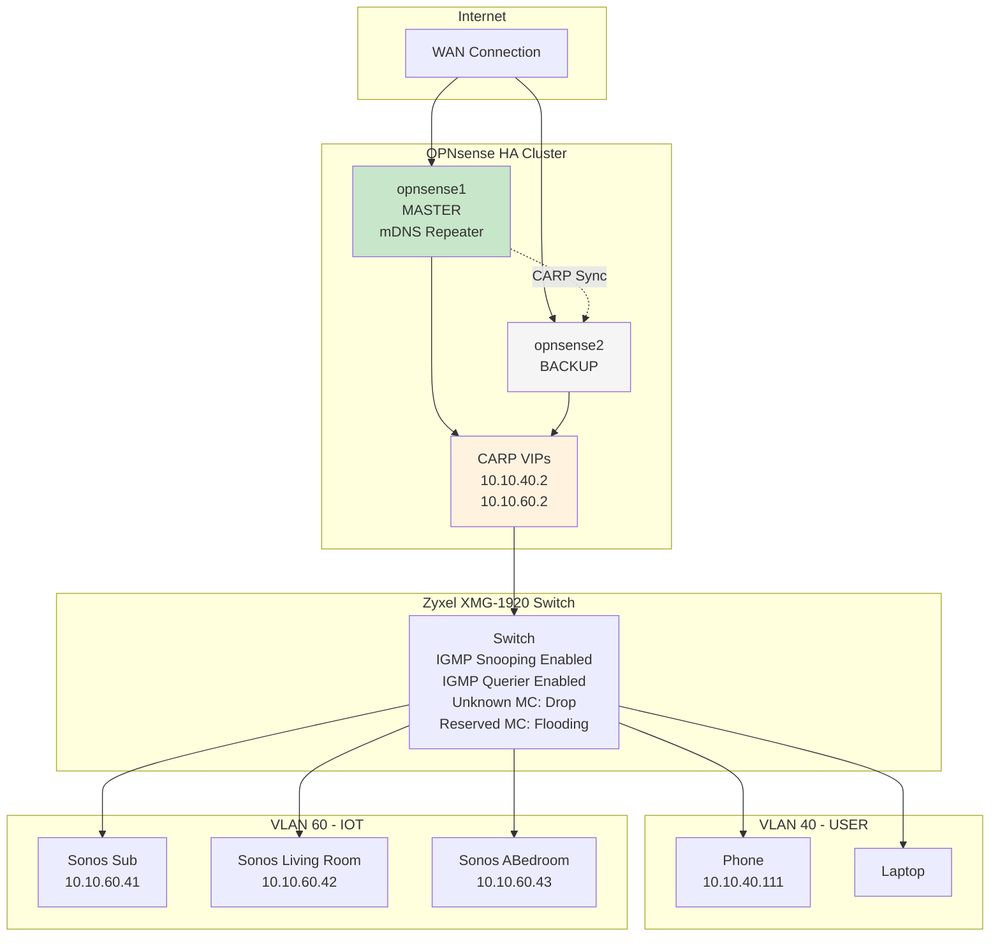
```mermaid
graph TB
    subgraph Internet
        WAN[WAN Connection]
    end
    
    subgraph "OPNsense HA Cluster"
        OPN1[opnsense1<br/>MASTER<br/>mDNS Repeater]
        OPN2[opnsense2<br/>BACKUP]
        CARP[CARP VIPs<br/>10.10.40.2<br/>10.10.60.2]
    end
    
    subgraph "Zyxel XMG-1920 Switch"
        SW[Switch<br/>IGMP Snooping Enabled<br/>IGMP Querier Enabled<br/>Unknown MC: Drop<br/>Reserved MC: Flooding]
    end
    
    subgraph "VLAN 40 - USER"
        Phone[Phone<br/>10.10.40.111]
        Laptop[Laptop]
    end
    
    subgraph "VLAN 60 - IOT"
        S1[Sonos Sub<br/>10.10.60.41]
        S2[Sonos Living Room<br/>10.10.60.42]
        S3[Sonos ABedroom<br/>10.10.60.43]
    end
    
    WAN --> OPN1
    WAN --> OPN2
    OPN1 -.->|CARP Sync| OPN2
    OPN1 --> CARP
    OPN2 --> CARP
    CARP --> SW
    
    SW --> Phone
    SW --> Laptop
    SW --> S1
    SW --> S2
    SW --> S3
    
    style OPN1 fill:#c8e6c9
    style OPN2 fill:#f5f5f5
    style CARP fill:#fff3e0
```

### OPNsense Configuration

**mDNS Repeater:**
- Service: Enabled
- Interfaces: `vlan0.40` (USER), `vlan0.60` (IOT)
- Enable CARP Failover: Yes (service runs on active node only)

**IGMP Proxy:**
- Status: Disabled (not needed for simple discovery)

**Firewall Rules (VLAN 40 - USER):**
1. Allow USER → IOT multicast (224.0.0.0/4) port 5353 (mDNS)
2. Allow USER → IOT unicast port 1400 (Spotify Connect to Sonos)

**Firewall Rules (VLAN 60 - IOT):**
- No additional rules needed (stateful firewall allows return traffic)

### Zyxel Switch Configuration

**IPv4 Multicast → IGMP Snooping:**
- Status: Enabled
- Host-Based Timeout: 260 seconds

**IGMP Snooping VLAN Configuration:**
- Mode: Auto (learns querier from network)
- Querier Status: Enabled (acts as backup querier)
- Host Timeout: 260 seconds
- 802.1p Priority: No-Change
- Unknown Multicast Frame Reserved Multicast Group: **Drop** / **Flooding** ✓
- VLANs Configured: 40 (USER), 60 (IOT)

**Port Configuration:**
- All ports: IGMP Snooping enabled
- Speed: Auto negotiation
- Flow Control: Disabled

### Why This Configuration Works

```mermaid
graph TD
    A[Phone sends mDNS query<br/>to 224.0.0.251:5353] --> B{Switch receives packet<br/>on USER VLAN port}
    
    B --> C{IGMP Snooping:<br/>Reserved MC = Flooding?}
    C -->|Yes| D[Floods to all USER VLAN ports<br/>including trunk to OPNsense]
    
    D --> E{OPNsense receives query<br/>on vlan0.40 interface}
    
    E --> F{Firewall rule allows<br/>USER → multicast:5353?}
    F -->|Yes| G{mDNS Repeater running?}
    
    G -->|Yes| H[Repeater copies packet<br/>and retransmits to vlan0.60]
    
    H --> I{Switch receives packet<br/>on trunk from OPNsense}
    
    I --> J{IGMP Snooping:<br/>Reserved MC = Flooding?}
    J -->|Yes| K[Floods to all IOT VLAN ports]
    
    K --> L[Sonos speakers receive query]
    
    L --> M[Speakers send mDNS responses<br/>to 224.0.0.251:5353]
    
    M --> N[Responses flow back through<br/>same path in reverse]
    
    N --> O{Phone receives responses}
    
    O --> P{App validates source IP?}
    P -->|Strict| Q[❌ Sonos app rejects<br/>Wrong source IP]
    P -->|Lenient| R[✓ Spotify Connect accepts<br/>Discovery successful]
    
    R --> S[Phone connects directly<br/>to speaker IP:1400]
    
    S --> T{Firewall allows<br/>USER → IOT:1400?}
    T -->|Yes| U[✓ Connection established<br/>Spotify control works!]
    
    style A fill:#e3f2fd
    style R fill:#c8e6c9
    style U fill:#c8e6c9
    style Q fill:#ffebee
```

### Traffic Flow Example

**Spotify Discovery and Control:**

1. **Discovery (mDNS):**
   ```
   Phone (10.10.40.111:5353) 
     → 224.0.0.251:5353 (multicast query)
     → Switch (floods VLAN 40)
     → OPNsense vlan0.40 (receives query)
     → mDNS Repeater (copies to vlan0.60)
     → Switch (floods VLAN 60)
     → Sonos speakers (receive query)
   
   Sonos speakers (10.10.60.42:5353)
     → 224.0.0.251:5353 (multicast response)
     → Switch (floods VLAN 60)
     → OPNsense vlan0.60 (receives response)
     → mDNS Repeater (copies to vlan0.40, SOURCE REWRITTEN)
     → Switch (floods VLAN 40)
     → Phone (receives response from 10.10.40.2 instead of 10.10.60.42)
   ```

2. **Control (Spotify Connect):**
   ```
   Phone (10.10.40.111:random)
     → 10.10.60.42:1400 (direct unicast)
     → OPNsense (firewall rule allows)
     → Switch (routes to VLAN 60 port)
     → Sonos speaker (receives control command)
   
   Sonos speaker (10.10.60.42:1400)
     → 10.10.40.111:random (response)
     → Switch (routes to VLAN 40 port)
     → OPNsense (stateful return allowed)
     → Phone (receives response)
   ```

## Troubleshooting Decision Tree

```mermaid
graph TD
    Start[Spotify Connect not working] --> Q1{Can ping speaker IP<br/>from phone?}
    
    Q1 -->|No| FW1[Check firewall rules<br/>Allow USER → IOT ICMP]
    Q1 -->|Yes| Q2{tcpdump shows mDNS<br/>queries leaving VLAN 40?}
    
    Q2 -->|No| MDR1[Check mDNS Repeater<br/>ps aux | grep mdns]
    Q2 -->|Yes| Q3{tcpdump shows mDNS<br/>queries arriving VLAN 60?}
    
    Q3 -->|No| REP1[Check mDNS Repeater config<br/>Interfaces correct?]
    Q3 -->|Yes| Q4{Sonos speakers respond?}
    
    Q4 -->|No| SP1[Check speakers online<br/>Check IGMP snooping on switch]
    Q4 -->|Yes| Q5{Responses arrive back<br/>at phone VLAN 40?}
    
    Q5 -->|No| REP2[Check return path<br/>mDNS Repeater working both ways?]
    Q5 -->|Yes| Q6{Spotify app shows speakers?}
    
    Q6 -->|No| APP1[Clear Spotify app cache<br/>Force close and retry]
    Q6 -->|Yes| Q7{Can play music?}
    
    Q7 -->|No| FW2[Check firewall rules<br/>Allow USER → IOT port 1400]
    Q7 -->|Yes| SUCCESS[✓ Everything working!]
    
    FW1 --> RETEST1[Retest]
    MDR1 --> RETEST1
    REP1 --> RETEST1
    SP1 --> RETEST1
    REP2 --> RETEST1
    APP1 --> RETEST1
    FW2 --> RETEST1
    RETEST1 --> Q1
    
    style SUCCESS fill:#c8e6c9
    style Start fill:#ffebee
```

## Key Learnings from Implementation

### What Worked

1. **mDNS Repeater** - Successfully relays discovery traffic between VLANs
2. **Minimal Firewall Rules** - Only 2 rules needed on USER VLAN
3. **IGMP Snooping** - Optimizes multicast forwarding without breaking functionality
4. **Reserved Multicast Flooding** - Essential for link-local protocols like mDNS
5. **Spotify Connect** - More forgiving than Sonos app, works perfectly across VLANs
6. **Stateful Firewall** - Return traffic automatically allowed, no rules needed on IOT VLAN

### What Didn't Work

1. **UDP Broadcast Relay** - Created packet loops and network outages
2. **IGMP Proxy** - Unnecessary complexity for simple service discovery
3. **Reserved Multicast Drop** - Broke all mDNS functionality
4. **Sonos App Cross-VLAN** - Source IP validation prevents discovery with mDNS Repeater

### Security Considerations

**Current Security Posture:**
- IOT devices cannot initiate connections to USER VLAN ✓
- Only specific services (mDNS, Spotify Connect) allowed from USER to IOT ✓
- Multicast flooding limited to reserved range (224.0.0.0-224.0.0.255) ✓
- Unknown multicast dropped (prevents unnecessary flooding) ✓

**Acceptable Risks:**
- mDNS responses show OPNsense IP instead of speaker IPs (cosmetic)
- Reserved multicast flooded (necessary for discovery protocols)
- Spotify Connect port 1400 open (limited to specific service)

## Future Enhancements

### Guest Network Extension

To extend configuration to Guest VLAN:

1. Add Guest VLAN interface to mDNS Repeater
2. Add firewall rules:
   - Allow Guest → IOT multicast port 5353
   - Allow Guest → IOT unicast port 1400
3. Test Spotify Connect from guest devices
4. Document limitations (Sonos app won't work)

### Alternative Solutions

**If Sonos App Required:**
- Consider separate "Media Control" VLAN with direct access to speakers
- Use VPN to temporarily join IOT VLAN for Sonos app configuration
- Accept limitation: Configuration from IOT VLAN only, control via Spotify

## References

- **RFC 1112**: IP Multicast specification
- **RFC 2236**: IGMPv2 specification  
- **RFC 3376**: IGMPv3 specification
- **RFC 6762**: mDNS specification
- **Sonos Integration Guide**: <https://docs.sonos.com>
- **OPNsense Documentation**: <https://docs.opnsense.org>

## Glossary

- **CARP**: Common Address Redundancy Protocol - high availability protocol for creating virtual IPs
- **IGMP**: Internet Group Management Protocol - manages multicast group membership
- **IGMP Snooping**: Switch feature to optimize multicast traffic forwarding
- **IGMP Querier**: Device that sends periodic queries to discover multicast subscribers
- **mDNS**: Multicast DNS - zero-configuration service discovery protocol
- **Multicast**: One-to-many communication to subscribed group members
- **Link-Local**: Traffic that never leaves local network segment (224.0.0.0/24)
- **Reserved Multicast**: Special multicast range 224.0.0.0-224.0.0.255 for local protocols
- **Spotify Connect**: Protocol allowing devices to control Spotify playback on speakers
- **VLAN**: Virtual LAN - logical network segmentation on physical switch
- **VIP**: Virtual IP - shared IP address in high availability configuration