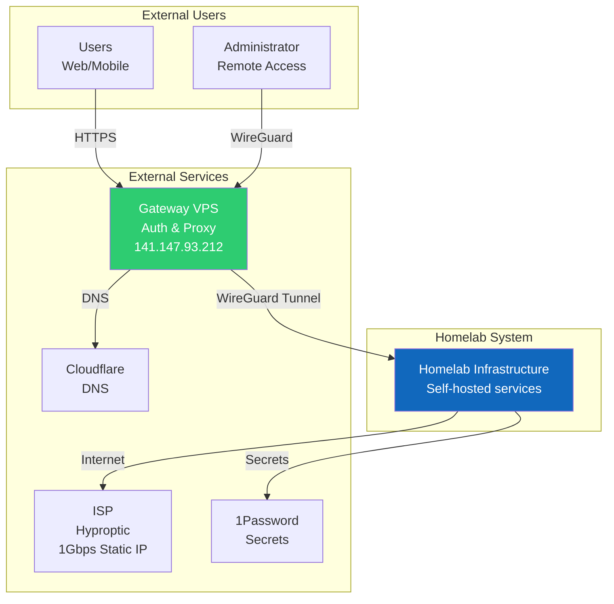
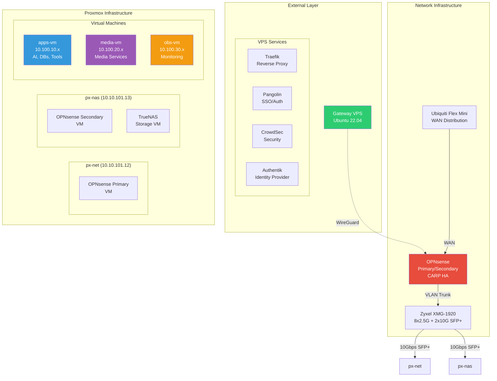
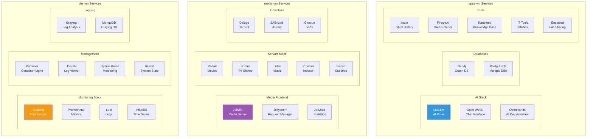
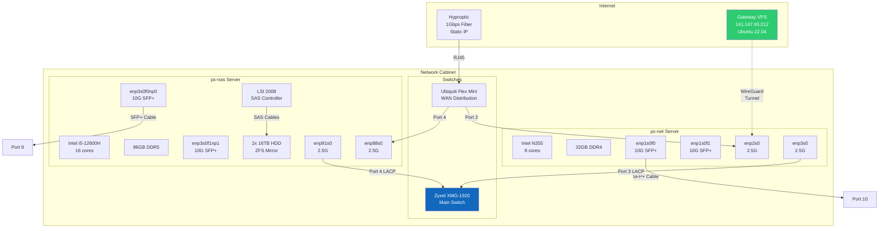

# C4 Architecture Diagrams

## Level 1: System Context Diagram

## Level 2: Container Diagram (High-Level Components)

## Level 3: Component Diagram (Service Distribution)

## Level 4: Deployment Diagram (Physical Network)

## Diagram Key

### Colors
- 🟦 Blue: Core infrastructure components
- 🟩 Green: External/gateway services  
- 🟥 Red: Critical network infrastructure
- 🟪 Purple: Media services
- 🟨 Orange: Monitoring/observability

### Line Types
- Solid lines: Physical connections
- Dashed lines: Logical connections (tunnels, etc.)
- Arrows indicate data flow direction

### Component Types
- Rectangles: Physical devices or VMs
- Rounded rectangles: Services/applications
- Subgraphs: Logical groupings