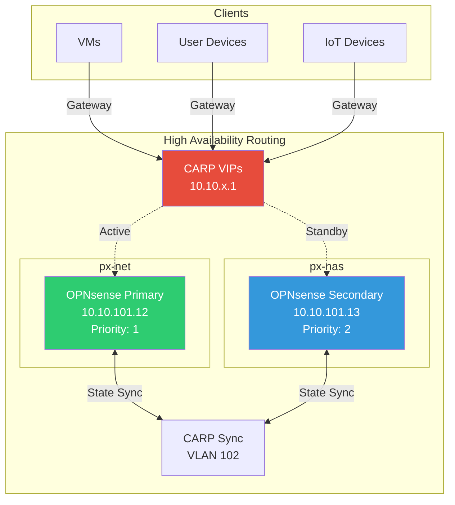
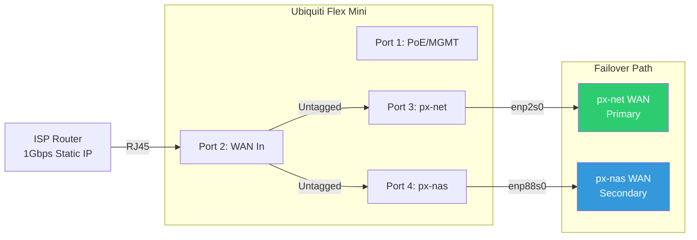
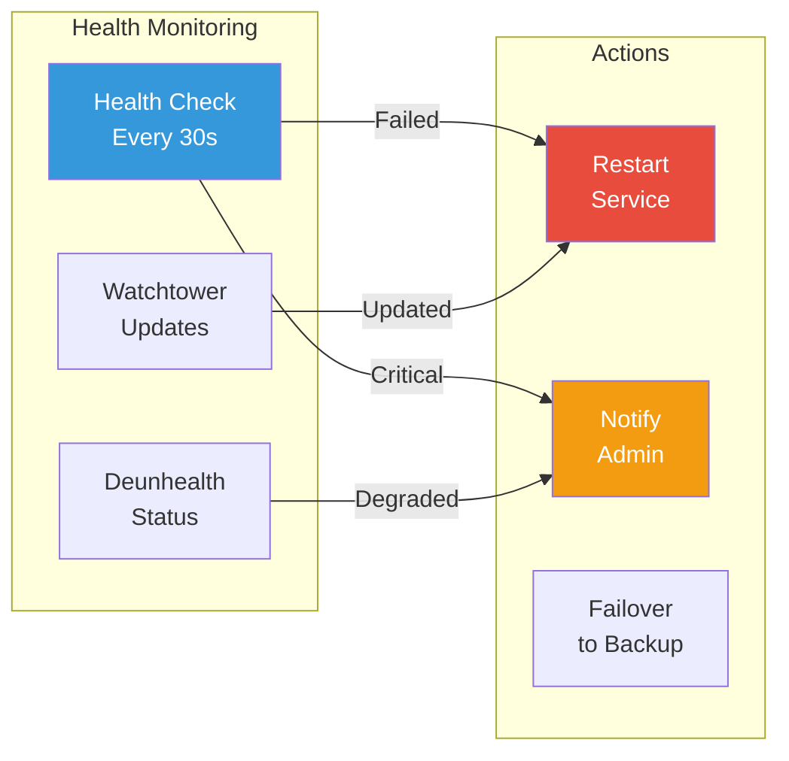
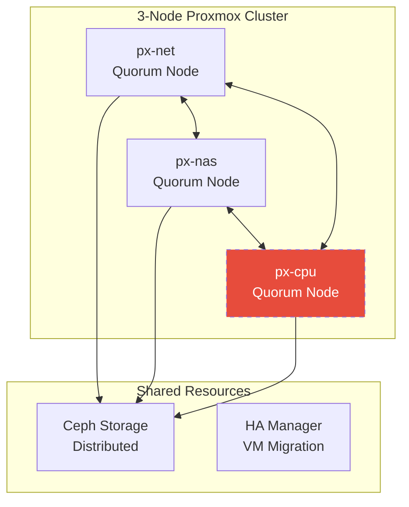

# High Availability Configuration

## Overview

The homelab implements high availability at multiple layers:
- **Network Level**: Dual OPNsense routers with CARP failover
- **Service Level**: Container health monitoring and auto-restart
- **Storage Level**: ZFS mirror on TrueNAS
- **Future**: Proxmox clustering and service orchestration

## OPNsense CARP Configuration

### Architecture


### CARP Virtual IPs

| VLAN | Virtual IP | Description | VHID |
|------|------------|-------------|------|
| 10 | 10.10.10.1 | LAB Gateway | 10 |
| 40 | 10.10.40.1 | USER Gateway | 40 |
| 60 | 10.10.60.1 | IOT Gateway | 60 |
| 101 | 10.10.101.1 | MGMT Gateway | 101 |

### Failover Configuration

```yaml
Primary (px-net):
  Base Priority: 1
  Preemption: Enabled
  Advertising Frequency: 1 second
  
Secondary (px-nas):
  Base Priority: 2
  Preemption: Enabled
  Advertising Frequency: 1 second

Failover Time: < 3 seconds
Failback: Automatic when primary recovers
```

### State Synchronization

**Synchronized Components**:
- Firewall rules
- NAT configuration
- DHCP leases
- IPsec tunnels
- User certificates
- Aliases and tables

**Sync Interface**: VLAN 102 (dedicated)
**Sync Protocol**: pfsync over dedicated VLAN
**Security**: Encrypted with shared key

## WAN Failover Design

### Dual WAN Connectivity


**Failover Behavior**:
- Both OPNsense instances have independent WAN connections
- Active instance handles all WAN traffic
- On failover, secondary takes over with same public IP
- Gateway monitoring triggers failover on WAN failure

## Service High Availability

### Container Management
```yaml
Restart Policies:
  - unless-stopped: Default for all services
  - always: Critical services (Traefik, Pangolin)
  
Health Checks:
  - Interval: 30s
  - Timeout: 10s
  - Retries: 3
  - Start Period: 40s
```

### Monitoring Stack
- **Uptime Kuma**: Service availability monitoring
- **Deunhealth**: Docker health status aggregation
- **Gotify**: Alert notifications
- **Grafana**: Dashboards and alerting

### Automated Recovery


## Storage High Availability

### TrueNAS Configuration
- **Pool**: 2x 16TB HDDs in ZFS mirror
- **Redundancy**: Single disk failure tolerance
- **Scrub Schedule**: Weekly
- **Snapshots**: Hourly (24), Daily (7), Weekly (4)
- **Replication**: Planned to backup location

### VM Storage
- **Local-ZFS**: On each Proxmox host
- **Shared Storage**: NFS from TrueNAS
- **Backup**: Proxmox Backup Server (planned)

## Future HA Enhancements

### Proxmox Clustering (Planned)


### Service Orchestration (Planned)
- **Nomad**: Distributed scheduler
- **Consul**: Service discovery
- **Vault**: Secret management
- **Benefits**:
  - Automatic service placement
  - Rolling updates
  - Self-healing
  - Resource optimization

## Monitoring and Alerting

### Key Metrics
- CARP status changes
- WAN connectivity
- Service health status
- Disk usage and health
- CPU/Memory utilization

### Alert Channels
- Gotify push notifications
- Email via Resend API
- Grafana dashboard alerts
- Uptime Kuma status page

## Recovery Procedures

### OPNsense Failover Test
```bash
# Manual failover test
1. SSH to primary OPNsense
2. Maintenance mode: ifconfig carpX down
3. Verify secondary takes over
4. Restore: ifconfig carpX up

# Monitor during failover
tail -f /var/log/system.log | grep carp
```

### Service Recovery Priority
1. **Critical**: Routing, DNS, DHCP
2. **High**: Authentication, reverse proxy
3. **Medium**: Application services
4. **Low**: Monitoring, logging

## Best Practices

1. **Regular Testing**: Monthly failover tests
2. **Documentation**: Runbooks for common failures
3. **Monitoring**: Proactive alerting before failures
4. **Maintenance Windows**: Planned with notifications
5. **Backup Verification**: Regular restore tests
6. **Change Management**: Test in dev before production