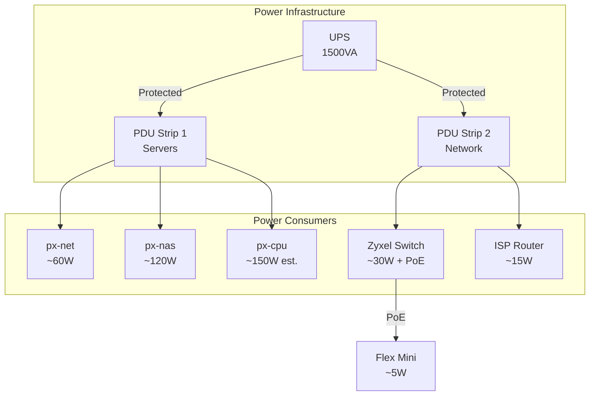

# Physical Network Topology

## Rack Layout and Physical Connections

### Network Cabinet Organization

```
┌─────────────────────────────────────────────┐
│                 TOP OF RACK                 │
├─────────────────────────────────────────────┤
│ ┌─────────────────────────────────────────┐ │
│ │         Ubiquiti Flex Mini (PoE)        │ │
│ │  [1]  [2]  [3]  [4]  [5]                │ │
│ │  PoE  WAN  px-  px-  --                 │ │
│ │  In   ISP  net  nas                     │ │
│ └─────────────────────────────────────────┘ │
│                                             │
│ ┌─────────────────────────────────────────┐ │
│ │      Zyxel XMG-1920 (Main Switch)       │ │
│ │  [1] [2] [3] [4] [5] [6] [7] [8]        │ │
│ │  Flex MGMT T3   T4  cpu  KVM QNAP WiFi  │ │
│ │                                          │ │
│ │  [9-SFP+]  [10-SFP+]                    │ │
│ │  px-nas    px-net                       │ │
│ └─────────────────────────────────────────┘ │
│                                             │
│ ┌─────────────────────────────────────────┐ │
│ │            px-net Server                 │ │
│ │  Intel N355, 32GB RAM                    │ │
│ │  [eth1] [eth2] [sfp1] [sfp2]            │ │
│ │   2.5G   2.5G   10G    10G              │ │
│ └─────────────────────────────────────────┘ │
│                                             │
│ ┌─────────────────────────────────────────┐ │
│ │            px-nas Server                 │ │
│ │  Intel i5-12600H, 96GB RAM               │ │
│ │  [eth1] [eth2] [sfp1] [sfp2] [TB4] [TB4]│ │
│ │   2.5G   2.5G   10G    10G              │ │
│ │                                          │ │
│ │  LSI SAS → 2x 16TB HDDs                 │ │
│ └─────────────────────────────────────────┘ │
│                                             │
│ ┌─────────────────────────────────────────┐ │
│ │         px-cpu Server (Future)           │ │
│ │  Intel i9-13900, 96GB RAM                │ │
│ │  [eth1] [eth2] [TB4] [TB4]              │ │
│ │   2.5G   2.5G                           │ │
│ └─────────────────────────────────────────┘ │
│                                             │
│ ┌─────────────────────────────────────────┐ │
│ │          ISP Router/Modem                │ │
│ │      Hyproptic 1Gbps Fiber              │ │
│ └─────────────────────────────────────────┘ │
└─────────────────────────────────────────────┘
```

## Cable Matrix

### Primary Data Connections (10Gbps)
| Connection | Type | From Device | From Port | To Device | To Port | Purpose |
|------------|------|-------------|-----------|-----------|---------|---------|
| 1 | SFP+ DAC | px-net | enp1s0f0 | Zyxel | Port 10 | VLAN Trunk |
| 2 | SFP+ DAC | px-nas | enp3s0f0np0 | Zyxel | Port 9 | VLAN Trunk |

### Management Connections (2.5Gbps)
| Connection | Type | From Device | From Port | To Device | To Port | Purpose |
|------------|------|-------------|-----------|-----------|---------|---------|
| 3 | Cat6 | px-net | enp3s0 | Zyxel | Port 3 | MGMT/LACP |
| 4 | Cat6 | px-nas | enp91s0 | Zyxel | Port 4 | MGMT/LACP |
| 5 | Cat6 | px-cpu | eth1 | Zyxel | Port 5 | MGMT (Future) |

### WAN Connections
| Connection | Type | From Device | From Port | To Device | To Port | Purpose |
|------------|------|-------------|-----------|-----------|---------|---------|
| 6 | Cat6 | ISP Router | LAN | Flex Mini | Port 2 | Internet |
| 7 | Cat6 | Flex Mini | Port 3 | px-net | enp2s0 | WAN |
| 8 | Cat6 | Flex Mini | Port 4 | px-nas | enp88s0 | WAN |

### Infrastructure Connections
| Connection | Type | From Device | From Port | To Device | To Port | Purpose |
|------------|------|-------------|-----------|-----------|---------|---------|
| 9 | Cat6 | Zyxel | Port 1 | Flex Mini | Port 1 | PoE/MGMT |
| 10 | Cat6 | Zyxel | Port 8 | WiFi AP | - | Trunk |
| 11 | Cat6 | Zyxel | Port 7 | QNAP | - | Storage |

## Port Speed Reference

### Zyxel XMG-1920
- Ports 1-8: 2.5 Gbps (PoE+ capable)
- Ports 9-10: 10 Gbps SFP+
- Switching Capacity: 40 Gbps
- PoE Budget: 130W

### Server Network Interfaces
```yaml
px-net:
  enp1s0f0: 10G SFP+ (VLAN trunk to Zyxel port 10)
  enp1s0f1: 10G SFP+ (unused)
  enp2s0: 2.5G RJ45 (WAN from Flex Mini)
  enp3s0: 2.5G RJ45 (MGMT to Zyxel port 3)

px-nas:
  enp3s0f0np0: 10G SFP+ (VLAN trunk to Zyxel port 9)
  enp3s0f1np1: 10G SFP+ (unused)
  enp88s0: 2.5G RJ45 (WAN from Flex Mini)
  enp91s0: 2.5G RJ45 (MGMT to Zyxel port 4)

px-cpu (planned):
  eth1: 2.5G RJ45 (MGMT to Zyxel port 5)
  eth2: 2.5G RJ45 (future use)
  TB4-1: Thunderbolt 4 (future 10G adapter)
  TB4-2: Thunderbolt 4 (future 10G adapter)
```

## Power Distribution



### Power Budget
- **Total Capacity**: 1500VA / ~1350W
- **Current Load**: ~350W (26% capacity)
- **With px-cpu**: ~500W (37% capacity)
- **Runtime**: ~25 minutes at current load

## Environmental Considerations

### Cooling
- **Ambient**: 20-22°C maintained
- **Airflow**: Front-to-back for all servers
- **Hot Aisle**: Rear exhaust area

### Cable Management
- **Data**: Blue cables for network
- **Power**: Black cables
- **Management**: Yellow cables
- **Labeling**: Both ends labeled

## Physical Security

### Access Control
- Locked cabinet
- Security cameras
- Environmental monitoring

### Redundancy
- Dual power supplies (where available)
- Dual network paths
- Spare cables pre-run

## Future Expansion Considerations

### Available Ports
- **Zyxel**: Ports 6 available
- **SFP+**: 2x unused on each server
- **Flex Mini**: Port 5 available

### Planned Additions
1. **px-cpu Integration**:
   - Already provisioned on Zyxel port 5
   - May need TB4 to 10GbE adapters
   
2. **Storage Expansion**:
   - External SAS enclosure option
   - Additional NAS consideration

3. **Network Upgrades**:
   - Potential 10G switch upgrade
   - More SFP+ connections

### Rack Space
- Current: 12U used of 24U
- Reserved: 4U for px-cpu
- Available: 8U for expansion

## Maintenance Access

### Front Access Required
- Server power/reset buttons
- Drive bays (px-nas)
- USB ports for emergency access

### Rear Access Required
- Network connections
- Power connections
- SAS cables (px-nas)

### Service Loops
- 1m excess on all cables
- Allows rack slide-out
- Simplifies maintenance