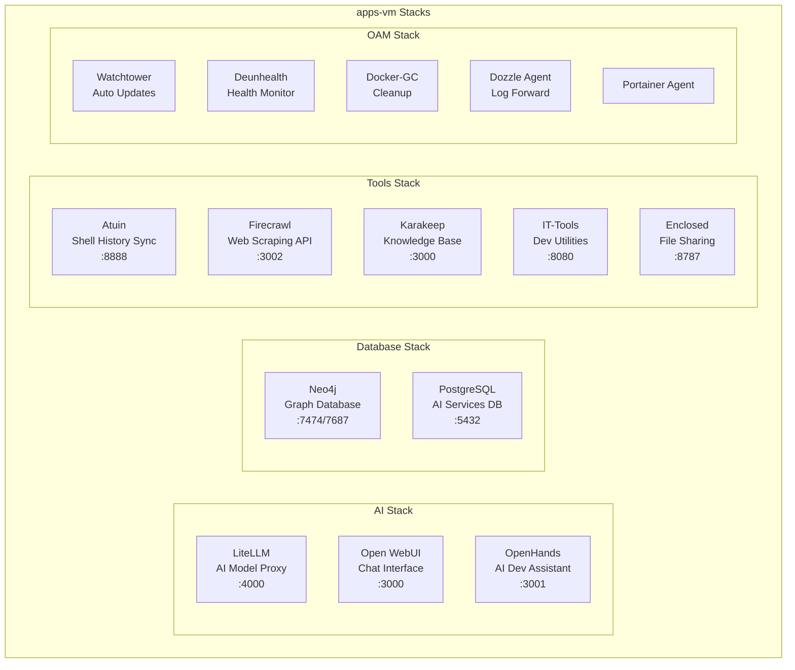
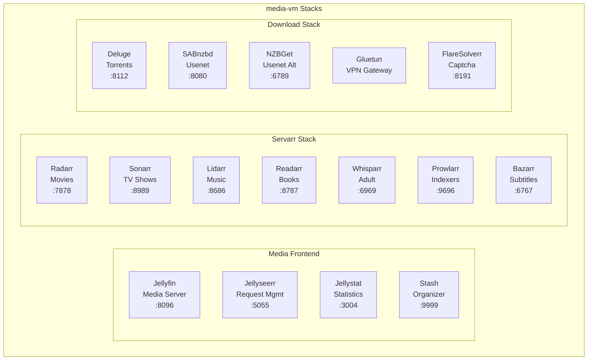
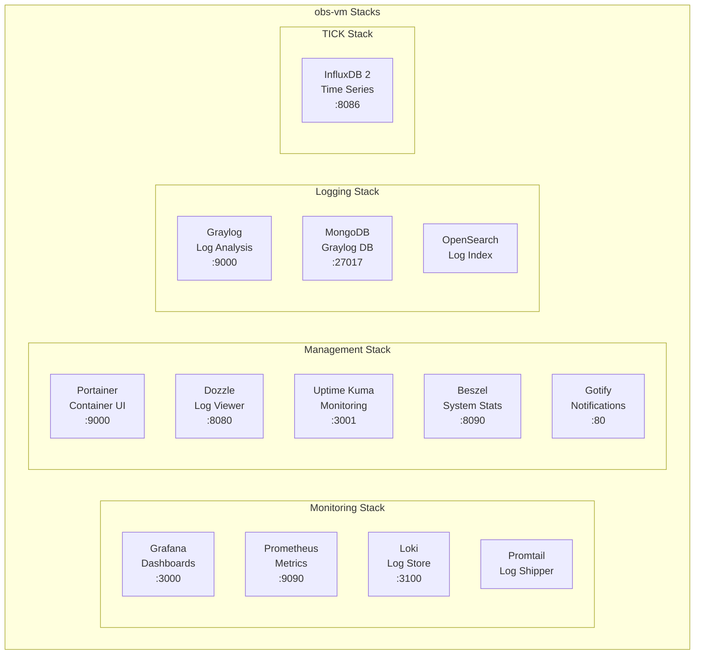
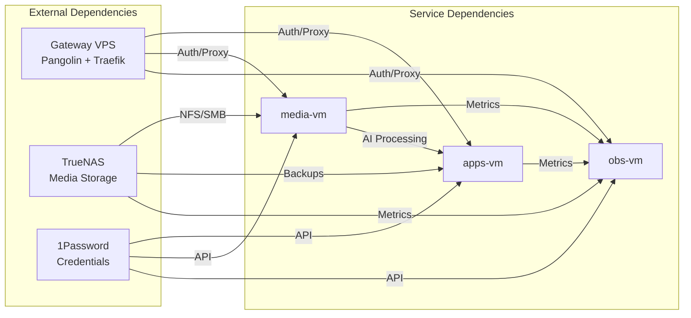

# Service Distribution

## Current Service Allocation

The homelab services are distributed across three VMs based on function and resource requirements. Each VM runs multiple Docker stacks managed through Ansible.

## Service Distribution by VM

### apps-vm (10.100.10.x)
**Purpose**: AI services, databases, and productivity tools  
**Resources**: Optimized for CPU and memory-intensive workloads



### media-vm (10.100.20.x)
**Purpose**: Media management and streaming services  
**Resources**: Optimized for storage I/O and transcoding



### obs-vm (10.100.30.x)
**Purpose**: Monitoring, logging, and observability  
**Resources**: Optimized for data ingestion and querying



## Common Services (All VMs)

Each VM runs a standard OAM (Operations, Administration, Maintenance) stack:

| Service | Purpose | Notes |
|---------|---------|-------|
| Watchtower | Automatic container updates | Scheduled updates |
| Deunhealth | Health status aggregation | Reports to Uptime Kuma |
| Docker-GC | Container/image cleanup | Prevents disk fill |
| Socket-Proxy | Secure Docker API access | For management tools |
| Dozzle Agent | Centralized log viewing | Forwards to obs-vm |
| Portainer Agent | Remote container management | Managed from obs-vm |

## Service Dependencies



## Resource Allocation Guidelines

### CPU Allocation
- **apps-vm**: High CPU for AI workloads
- **media-vm**: Moderate CPU for transcoding
- **obs-vm**: Moderate CPU for data processing

### Memory Allocation
- **apps-vm**: High memory for databases and AI models
- **media-vm**: Moderate memory for caching
- **obs-vm**: High memory for log retention

### Storage Allocation
- **apps-vm**: SSD for databases, moderate capacity
- **media-vm**: Large capacity, NFS mounts
- **obs-vm**: SSD for metrics, high IOPS

## Network Traffic Patterns

### Internal Traffic
```yaml
High Bandwidth:
  - media-vm ←→ TrueNAS (media files)
  - obs-vm ← all VMs (metrics/logs)
  
Moderate Bandwidth:
  - apps-vm ←→ Gateway (API traffic)
  - media-vm → apps-vm (AI processing)
  
Low Bandwidth:
  - Management traffic (SSH, Portainer)
  - Health checks and monitoring
```

### External Traffic
```yaml
Inbound (via Gateway VPS):
  - HTTPS to all services
  - API calls to AI services
  
Outbound:
  - Package updates
  - Docker image pulls
  - Media metadata fetching
  - AI model API calls
```

## Service Discovery and Routing

### Internal DNS (.lan)
- apps.lan → 10.100.10.x
- media.lan → 10.100.20.x
- obs.lan → 10.100.30.x

### Reverse Proxy (.lab.nobasura.org)
- Internal access via Caddy
- Service-specific subdomains
- SSL termination

### External Access (.nobasura.org)
- Via Gateway VPS
- Pangolin SSO authentication
- Traefik reverse proxy

## Future Service Distribution (with px-cpu)

### Proposed Redistribution
```yaml
px-cpu (Primary Compute):
  - All AI services (from apps-vm)
  - All databases (from apps-vm)
  - All tools (from apps-vm)
  - Critical monitoring (Prometheus, Grafana)
  - High availability services

apps-vm (Deprecated/Repurposed):
  - Development/testing environment
  - Non-critical experiments

px-nas (Storage Focus):
  - All media services (keep as-is)
  - TrueNAS VM
  - Backup services

obs-vm (Monitoring Focus):
  - Logging and analysis (keep as-is)
  - Non-critical monitoring
  - Historical data storage
```

### Benefits of Redistribution
1. **Performance**: AI/DB on most powerful hardware
2. **Reliability**: Critical services on HA-capable host
3. **Efficiency**: Better resource utilization
4. **Flexibility**: Easier maintenance and updates
5. **Scalability**: Room for growth on px-cpu