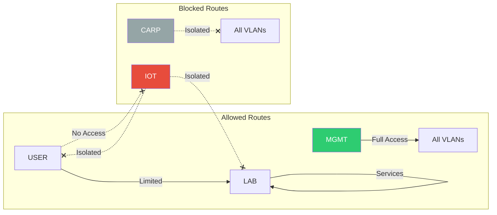

# VLAN Design and Routing

## VLAN Architecture Overview

The network uses 802.1Q VLAN tagging to segment traffic for security, performance, and management purposes. All VLANs are trunked through the main Zyxel switch with VLAN-aware bridges on Proxmox hosts.

## VLAN Definitions

### VLAN 1 - LAN (Default)
- **Purpose**: Default VLAN (unused as per best practice)
- **IP Range**: 10.10.1.0/24
- **Status**: Should remain unused
- **Access**: Blocked on all production ports

### VLAN 10 - LAB (Homelab Services)
- **Purpose**: All homelab services and VMs
- **IP Range**: 10.10.10.0/24
- **Gateway**: 10.10.10.1 (OPNsense)
- **Services**: All Docker containers and VMs
- **Switch Ports**: Fixed on ports 8-10, forbidden on 1-7

### VLAN 40 - USER (User Devices)
- **Purpose**: End-user devices (laptops, desktops, phones)
- **IP Range**: 10.10.40.0/24
- **Gateway**: 10.10.40.1 (OPNsense)
- **DHCP**: Enabled with reservations
- **Switch Ports**: Fixed on ports 2,8-10, forbidden on 1,3-7

### VLAN 60 - IOT (Internet of Things)
- **Purpose**: IoT devices requiring network isolation
- **IP Range**: 10.10.60.0/24
- **Gateway**: 10.10.60.1 (OPNsense)
- **Security**: Isolated from other VLANs
- **Switch Ports**: Fixed on ports 8-10, forbidden on 1-7

### VLAN 101 - MGMT (Management)
- **Purpose**: Infrastructure management interfaces
- **IP Range**: 10.10.101.0/24
- **Gateway**: 10.10.101.1 (OPNsense)
- **Devices**:
  - px-net: 10.10.101.12
  - px-nas: 10.10.101.13
  - Zyxel switch: 10.10.101.4
- **Switch Ports**: Fixed on ports 1-8, untagged on 1-2,5-6,9-10

### VLAN 102 - CARP (High Availability)
- **Purpose**: CARP synchronization between OPNsense instances
- **IP Range**: 10.10.102.0/24
- **Usage**: Heartbeat and state synchronization
- **Security**: Isolated, no routing to other VLANs
- **Switch Ports**: Fixed on ports 3-4,8

### VLAN 666 - WAN (External Access)
- **Purpose**: WAN traffic isolation
- **Status**: Available on Flex Mini only
- **Security**: Blocked on main switch for security
- **Usage**: ISP connection distribution

## Routing Design

### OPNsense Virtual Router
```
Primary Router (px-net):
- WAN: vtnet1 (via vmbr1 → enp2s0 → Flex Mini)
- LAN Trunk: vtnet0 (via vmbr0 → enp1s0f0 SFP+)
- MGMT/SYNC: vlan02.101, vlan02.102

Secondary Router (px-nas):
- WAN: vtnet1 (via vmbr1 → enp88s0 → Flex Mini)
- LAN Trunk: vtnet0 (via vmbr0 → enp3s0f0np0 SFP+)
- MGMT/SYNC: vlan02.101, vlan02.102

CARP VIPs:
- VLAN 10: 10.10.10.1
- VLAN 40: 10.10.40.1
- VLAN 60: 10.10.60.1
- VLAN 101: 10.10.101.1
```

### Inter-VLAN Routing Rules



### Firewall Rules Summary

1. **MGMT (101)**: Full access to all VLANs for administration
2. **LAB (10)**: Can access internet and respond to USER requests
3. **USER (40)**: Can access LAB services and internet
4. **IOT (60)**: Internet only, fully isolated
5. **CARP (102)**: No routing, sync only

## Switch Port Configuration

### Zyxel XMG-1920 Port Assignments

| Port | Description | Mode | VLANs | LACP |
|------|-------------|------|-------|------|
| 1 | Unifi Flex Mini MGMT | Trunk | 101 (PVID) | No |
| 2 | MGMT Port | Access | 40 (untagged) | No |
| 3 | px-net MGMT (enp3s0) | Trunk | 101 (PVID), All | T3 |
| 4 | px-nas MGMT (enp91s0) | Trunk | 101 (PVID), All | T4 |
| 5 | px-cpu MGMT (future) | Trunk | 101 (PVID), All | No |
| 6 | KBS/JetKVM/Floating | Access | 101 | No |
| 7 | QNAP Aggregation | Access | 101 | No |
| 8 | WiFi AP | Trunk | 101 (PVID), All | No |
| 9 | px-nas SFP+ (enp3s0f0np0) | Trunk | 101 (PVID), All | No |
| 10 | px-net SFP+ (enp1s0f0) | Trunk | 101 (PVID), All | No |

### Ubiquiti Flex Mini Port Assignments

| Port | Description | VLANs |
|------|-------------|-------|
| 1 | PoE In/MGMT | 101 |
| 2 | WAN (ISP) | Native |
| 3 | px-net WAN (enp2s0) | Native |
| 4 | px-nas WAN (enp88s0) | Native |
| 5 | Unused | - |

## Proxmox Network Configuration

### VLAN-Aware Bridges
```
vmbr0: VLAN trunk for VM traffic (SFP+ connected)
- VLAN aware: yes
- VLAN IDs: 2-4094
- TSO disabled for compatibility

vmbr1: WAN bridge (2.5Gbps connected)
- VLAN aware: no
- Direct WAN passthrough

vmbr2: MGMT/SYNC bridge (LACP bond)
- VLAN aware: yes
- VLAN IDs: 2-4094
- Tagged interfaces for MGMT (101) and CARP (102)
```

## DNS and DHCP Configuration

### DNS Resolution
- **Internal DNS**: OPNsense Unbound resolver
- **.lan domains**: Direct A records to VM IPs
- **.lab.nobasura.org**: CNAME to .lan domains
- **External queries**: Forwarded to upstream DNS

### DHCP Scopes
- **VLAN 40 (USER)**: 10.10.40.100-200
- **VLAN 60 (IOT)**: 10.10.60.100-200
- **Static reservations**: For known devices
- **Options**: DNS, NTP, domain search

## Best Practices Implemented

1. **VLAN 1 Avoidance**: Default VLAN unused
2. **Management Isolation**: Dedicated MGMT VLAN
3. **IoT Segregation**: Complete isolation for security
4. **Trunk Minimization**: Only where necessary
5. **PVID Assignment**: Proper native VLAN configuration
6. **VLAN Pruning**: Forbidden VLANs on access ports
7. **Documentation**: All VLANs clearly defined and documented