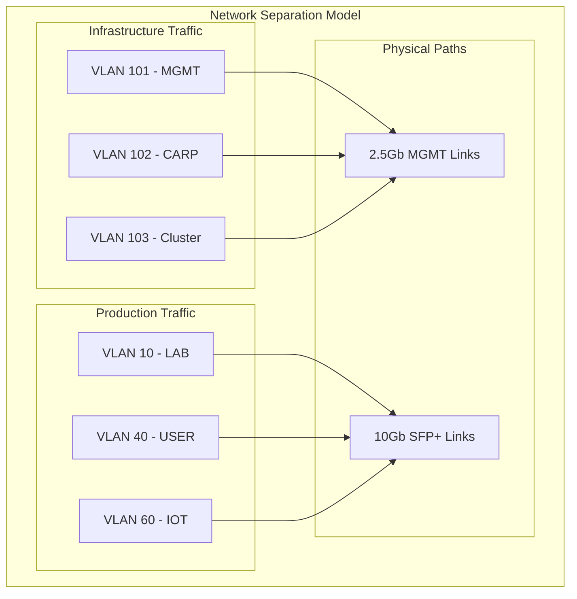

# Proxmox Clustering Network Design

## Cluster Network Requirements

### Corosync Network Needs
- **Latency**: < 2ms RTT required, < 1ms recommended
- **Packet Loss**: < 0.1% required
- **Bandwidth**: 1Gbps minimum, dedicated preferred
- **Reliability**: Redundant paths strongly recommended

## Recommended Cluster Network Design

### Option A: Dedicated Cluster VLAN (Recommended)
Create VLAN 103 for Proxmox cluster traffic:

```bash
# On each node, add to /etc/network/interfaces:

# Cluster network on existing MGMT bond
auto vmbr2.103
iface vmbr2.103 inet static
    address 10.10.103.12/24  # .13 for px-nas, .14 for px-cpu
    # No gateway - isolated network
```

### Option B: Use Existing MGMT Network
Use VLAN 101 (MGMT) for cluster traffic:
- Simpler but shared with management traffic
- Already configured and working
- May have more latency/jitter

### Option C: Dedicated Physical Network (Best Performance)
Use the unused SFP+ ports for dedicated cluster network:
- Lowest latency, highest reliability
- Requires additional cabling
- Overkill for 3 nodes

## Cluster Configuration by Option

### If Going with 3-Node Cluster

```bash
# On px-net (first node):
pvecm create homelab-cluster \
  --ring0_addr 10.10.103.12 \
  --bindnet0_addr 10.10.103.0/24

# On px-nas:
pvecm join 10.10.103.12 \
  --ring0_addr 10.10.103.13

# On px-cpu:
pvecm join 10.10.103.12 \
  --ring0_addr 10.10.103.14
```

### If Going with 2-Node Cluster + QDevice

```bash
# On px-nas (first node):
pvecm create compute-cluster \
  --ring0_addr 10.10.103.13 \
  --bindnet0_addr 10.10.103.0/24

# On px-cpu:
pvecm join 10.10.103.13 \
  --ring0_addr 10.10.103.14

# On px-net (QDevice):
apt install corosync-qnetd
systemctl enable corosync-qnetd
systemctl start corosync-qnetd

# On px-nas (after cluster formed):
pvecm qdevice setup 10.10.103.12
```

## Critical Cluster Considerations

### 1. Fencing/Stonith
Without proper fencing, split-brain can occur:
- Consider IPMI/iDRAC if available
- Software watchdog as minimum
- Network power switches for remote power cycling

### 2. Storage Implications
```yaml
Shared Storage Options:
  - NFS from TrueNAS (simplest)
  - Ceph (requires 10Gbps network, 3 nodes)
  - ZFS replication (manual failover)
  
Local Storage:
  - VMs pinned to nodes
  - No automatic failover
  - Manual migration only
```

### 3. Network Separation



## Recommendation Priority

### For Your Use Case:

**1st Choice: 2-Node Cluster (px-nas + px-cpu)**
- Keeps px-net simple and reliable
- Clusters similar hardware
- Use QDevice for quorum
- Allows VM migration between compute nodes

**2nd Choice: Stay Standalone Initially**
- Start simple, cluster later
- Learn the environment first
- Add complexity gradually
- Matches your "gradual evolution" preference

**3rd Choice: 3-Node Cluster**
- Only if you want full HA immediately
- Adds complexity to critical network node
- Better quorum but more risk

## Implementation with Clustering

### Modified Phase 4: Cluster Formation (After px-cpu is stable)

```bash
# Day 5 (After everything else works):

1. Add VLAN 103 to all nodes
2. Test connectivity between nodes
3. Form cluster (2 or 3 node)
4. Configure QDevice if 2-node
5. Test VM migration
6. Configure HA policies
```

### Testing Cluster Health

```bash
# Verify cluster status
pvecm status

# Check node connectivity
pvecm nodes

# Test VM migration
qm migrate 100 px-cpu --online

# Monitor cluster logs
journalctl -u pve-cluster -f
```

## Cluster vs Standalone Decision Matrix

| Factor | Standalone | 2-Node+QD | 3-Node |
|--------|------------|-----------|---------|
| Complexity | Low | Medium | High |
| Reliability | High | High | Medium* |
| VM Mobility | Manual | Auto (2) | Auto (3) |
| Maintenance | Simple | Moderate | Complex |
| Risk to Network | None | None | Higher |

*3-node potentially less reliable due to px-net dual role

## Future Migration Path

Start Standalone → Add 2-Node Cluster → Expand to 3-Node:
1. Get px-cpu working standalone first
2. Form 2-node cluster when comfortable
3. Add px-net to cluster only if needed
4. Can always break cluster and revert